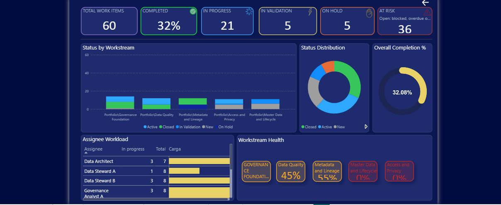

# Juliana Feitosa | Data Governance Portfolio

I am a Data Governance Analyst focused on turning policies into practical responsibilities, controls, and measurable routines. This portfolio brings together governance frameworks, delivery monitoring, maturity assessment, and access governance.

**Explore the operating model and inspect selected, synthetic evidence.** All portfolio documentation is in English.

## Start here

| Case | Business question | Published evidence |
| --- | --- | --- |
| [01 — Governance Framework](cases/01-governance-framework/) | Who owns the data, and how should it be governed? | Framework, RACI, classification matrix, lifecycle, and KPI catalog |
| [02 — Delivery Dashboard](cases/02-delivery-dashboard/) | What is progressing, and where does delivery need attention? | Synthetic CSV, metric definitions, model specification, preparation guide, release checklist, four Desktop screenshots, design mockups, and reviewed Power BI template |
| [03 — Maturity Assessment](cases/03-maturity-assessment/) | Which governance gaps should be addressed first? | High-level approach, synthetic aggregate results, and visual evidence |
| [04 — Access Governance](cases/04-access-governance/) | Who should have access, who approves it, and when should it end? | Demonstration operating model, permissions matrix, access lifecycle, review procedure, synthetic evidence, and metrics |

## Featured maturity evidence

The Maturity Assessment case presents a fictional eight-domain baseline and an aggregate result of **1.75 out of 3**. Its public scope is intentionally limited to the business problem, high-level assessment lifecycle, aggregate synthetic data, and visual evidence.

Complete questionnaires, scoring logic, validation criteria, reusable delivery playbooks, detailed datasets, and editable BI source files are retained outside the public portfolio.

## Delivery dashboard preview

*Actual screenshot of the synthetic Desktop report. The [case gallery](cases/02-delivery-dashboard/#dashboard-screenshots) includes Home, Executive, Operational and Backlog views.*

[Download the Delivery template](cases/02-delivery-dashboard/powerbi/DataGovernance_Delivery.pbit?raw=true) · [Usage and release notes](cases/02-delivery-dashboard/powerbi/README.md)

## What this portfolio demonstrates

- **Governance design:** ownership, stewardship, RACI, classification, metadata, and lifecycle controls.
- **Measurement:** KPI definitions, explicit denominators, assessment coverage, and evidence-based prioritization.
- **Business intelligence:** Power Query, DAX, semantic modeling, and dashboard requirements.
- **Operational control:** approvals, access reviews, exception handling, and release validation.
- **Communication:** translating technical controls into business decisions and reusable documentation.

## About the examples

These are public adaptations and demonstration designs. Synthetic records and scores are fictional and do not represent employer or client outcomes. Design proposals are distinguished from implemented or tested artifacts. The access-governance case is a newly authored demonstration, not evidence of a deployed access platform.

The maturity evidence is synthetic and demonstrates analytical communication only. It does not establish deployment, scheduled refresh, production security assurance, or the effectiveness of controls in a real organization.

## Publication boundary

The portfolio is a professional showcase, not the distribution channel for the complete TrustData methodology. Publication of complete methods is frozen. See the [publication policy](PUBLICATION_POLICY.md) for the current release gate and protected-content rules.

## Presentation and release status

- [Recruiter materials](docs/)
- [Publication tracker](docs/publication-status.md)
- Case 03 is limited to high-level and aggregate evidence. Complete methods and editable BI sources are withheld. Delivery screenshots and the reviewed Delivery template remain published; its dedicated risks page and visual/English polish remain.

## Contact

**Juliana Feitosa — Data Governance Analyst**  
[GitHub profile](https://github.com/jmfeitosa)

For a discussion, start with the framework and maturity cases: they show how responsibilities, evidence, and improvement priorities connect.
