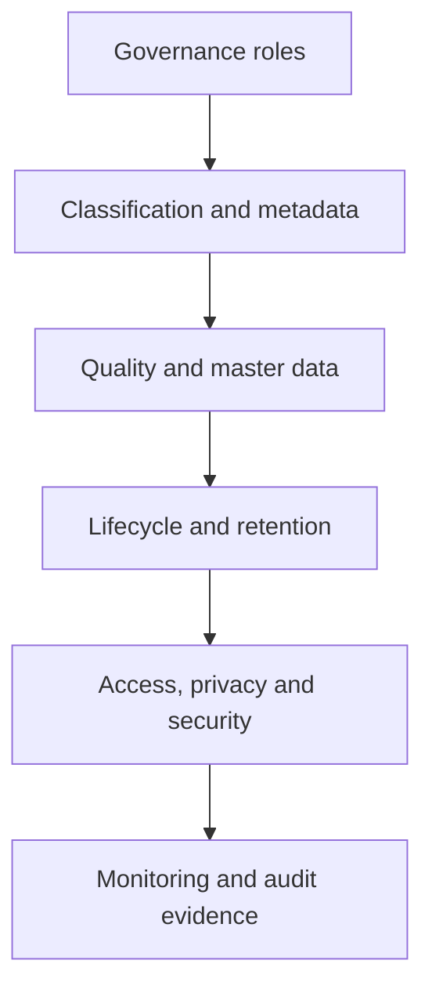

# Data Governance Framework

> A tool-agnostic operating model for governing data across its lifecycle, from collection and storage to sharing, retention, archival, and disposal.

## Overview

This case presents a practical Data Governance Framework designed to translate privacy, security, and data-management requirements into clear roles, processes, controls, and measurable governance routines.

The model is technology-agnostic, so it can be adapted to different cloud platforms, data catalogs, storage technologies, and organizational structures.

## Business challenge

Organizations often manage data through disconnected policies and technical controls. This creates common risks:

- unclear accountability for data assets;
- inconsistent classification and access decisions;
- incomplete metadata and lineage;
- duplicated or conflicting master data;
- weak retention and disposal evidence;
- limited visibility into quality, security, and compliance indicators.

## Proposed solution

The framework connects governance responsibilities, information classification, metadata, data quality, lifecycle management, privacy, access control, and auditability in a single operating model.

## Framework components

| Component | Purpose |
| --- | --- |
| Roles and RACI | Establish accountability across Data Owners, Data Stewards, Data Custodians, Data Users, Data Architects, Governance, Security, and Privacy teams. |
| Data classification | Apply protection requirements according to sensitivity and business context. |
| Metadata and lineage | Register ownership, classification, purpose, regulatory context, sources, and destinations. |
| Master and reference data | Define authoritative sources, unique identifiers, matching, merging, and survivorship rules. |
| Data lifecycle | Govern collection, use, sharing, retention, archival, and secure disposal. |
| Data quality | Monitor accuracy, completeness, timeliness, and remediation responsibilities. |
| Access governance | Combine least privilege, role-based access, segregation of duties, and periodic access reviews. |
| Privacy and consent | Maintain purpose, legal-basis, consent, sharing, revocation, and deletion traceability. |
| Audit and monitoring | Produce indicators and evidence for control effectiveness and continuous improvement. |

## Operating roles

| Role | Primary responsibility |
| --- | --- |
| Data Owner | Defines business purpose, classification, and access decisions. |
| Data Steward | Maintains metadata and quality rules and coordinates remediation. |
| Data Custodian | Implements technical safeguards, permissions, backup, and recovery controls. |
| Data User | Uses data according to approved purposes and reports integrity issues. |
| Data Architect | Defines data models, technical lineage, integration patterns, and architecture standards. |
| Data Governance Team | Maintains the framework, standards, classification model, and oversight routines. |
| Privacy / DPO | Validates privacy requirements, legal bases, consent, and sensitive reclassification decisions. |
| Security Operations | Monitors anomalies, supports incident response, and validates containment actions. |

## Example governance controls

- Mandatory ownership, classification, and purpose metadata for governed assets.
- Access requirements that are at least as restrictive as the asset classification.
- Formal approval for sensitive-data reclassification and external sharing.
- Traceable lineage before a governed asset is activated in the catalog.
- Authoritative-source and golden-record principles for master data.
- Defined retention and defensible disposal supported by audit evidence.
- Synthetic or masked data in non-production environments.
- Periodic access reviews and monitoring of inactive or excessive privileges.
- Quality thresholds with named owners and remediation workflows.

## Governance indicators

Examples of indicators defined by the model include:

- metadata completeness;
- critical-data quality score;
- master-data completeness and matching accuracy;
- percentage of access reviews completed;
- inactive-account or access-drift rate;
- mean time to detect and contain access anomalies;
- percentage of assets with validated classification and ownership;
- percentage of disposal events with auditable evidence.

## My contribution

- Designed the tool-agnostic governance structure.
- Defined governance roles and responsibility boundaries.
- Connected classification rules to access requirements.
- Structured operating procedures for metadata, master data, lifecycle, quality, privacy, security, and audit.
- Defined example controls, workflows, indicators, and audit evidence.
- Converted regulatory and policy requirements into an implementable operating model.

## Reference principles

The framework is informed by:

- data-management and stewardship practices;
- ISO/IEC 27001 information-security principles;
- ISO/IEC 20000 service-management principles;
- Brazil's General Data Protection Law (LGPD);
- privacy by design, least privilege, segregation of duties, and accountability.

## Next deliverables

This case will be expanded with:

- a public framework document;
- a roles and responsibilities matrix;
- a data-classification matrix;
- a governance lifecycle diagram;
- sample KPIs and control evidence;
- a Portuguese version.

## Important note

This portfolio case is an anonymized and tool-agnostic professional artifact. It contains no client data, confidential implementation details, credentials, or internal system identifiers. The controls shown are adaptable design examples and should be validated against each organization's legal, regulatory, risk, and technology context.
