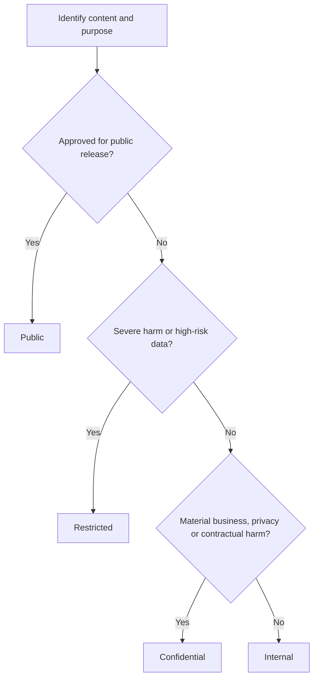

# Data Classification Matrix

[← Back to the case overview](README.md) · [View the complete framework](framework.md) · [View the RACI matrix](raci-matrix.md)

## Purpose

This matrix provides a tool-agnostic method for classifying data and translating its sensitivity, business value, and regulatory context into handling requirements.

It separates two complementary dimensions:

1. **Classification level** — how much protection the asset requires.
2. **Data category** — what kind of information the asset contains.

A data category can influence the classification, but it does not replace the classification decision.

## 1. Classification levels

| Level | Definition | Disclosure impact | Typical examples |
| --- | --- | --- | --- |
| **Public** | Approved for unrestricted external disclosure. | Minimal, provided the information is accurate and officially released. | Published reports, public website content, approved marketing materials, open datasets. |
| **Internal** | Intended for authorized organizational use. | Limited operational or reputational impact. | Internal procedures, general project documentation, non-sensitive meeting materials. |
| **Confidential** | Sensitive business or personal information requiring need-to-know access. | Material financial, operational, privacy, contractual, or reputational impact. | Customer records, employee data, non-public financial reports, contracts, business strategies. |
| **Restricted** | Highest-risk information requiring exceptional protection and tightly limited access. | Severe harm, legal exposure, fraud, identity compromise, security incident, or major business disruption. | Authentication secrets, cryptographic keys, highly sensitive personal data, privileged security data, regulated high-risk records. |

## 2. Classification precedence

When more than one classification could apply, use the most restrictive applicable level:

```text
Restricted > Confidential > Internal > Public
```

Key rules:

- Classification follows the highest-risk data element contained in the asset.
- Aggregation can increase sensitivity even when individual fields appear low-risk.
- Joining datasets can create new privacy or re-identification risks.
- Unclassified data defaults to **Internal** until reviewed.
- A system may apply stronger controls than the minimum required.
- Reducing a classification requires documented justification and approval.
- Classification must be reviewed when purpose, content, users, sharing, regulation, or risk changes.

## 3. Data categories

| Category | Description | Classification consideration |
| --- | --- | --- |
| Personal data | Information relating to an identified or identifiable person. | Usually Internal or Confidential; assess purpose, volume, identifiability, and applicable law. |
| Sensitive personal data | High-risk personal characteristics or records defined by applicable law or policy. | Usually Restricted, subject to legal and risk validation. |
| Financial data | Financial transactions, forecasts, pricing, accounts, or reporting information. | Internal to Restricted depending on materiality and publication status. |
| Commercial data | Customer, supplier, contract, pricing, strategy, and negotiation information. | Commonly Confidential. |
| Intellectual property | Proprietary methods, designs, source code, research, or trade secrets. | Confidential or Restricted depending on strategic value. |
| Security data | Vulnerabilities, privileged configurations, secrets, logs, or incident details. | Confidential or Restricted. Credentials and cryptographic secrets are Restricted. |
| Operational data | Information supporting daily processes and service delivery. | Internal to Confidential depending on business impact. |
| Public information | Information formally approved for public release. | Public only after publication authorization and integrity validation. |

Data categories should be adapted to the organization's legal, industry, and business context.

## 4. Minimum handling requirements

| Control area | Public | Internal | Confidential | Restricted |
| --- | --- | --- | --- | --- |
| Access | Open after publication approval | Authenticated organizational access | Named groups and need-to-know | Explicit approval and tightly limited named access |
| Data Owner | Required for governed assets | Required | Required | Required |
| Data Steward | Recommended | Required for governed assets | Required | Required |
| Encryption in transit | Required for managed systems | Required | Required | Required |
| Encryption at rest | According to platform standard | Required where supported by policy | Required | Required with enhanced key controls |
| External sharing | Permitted after release approval | Approved business channels | Formal owner approval and safeguards | Exceptional approval, risk review, and strong safeguards |
| Logging | Publication and change history | Standard platform logs | Access and change logging | Detailed access, change, export, and privileged-activity logging |
| Non-production use | Permitted if genuinely public | Approved organizational use | Masked or synthetic data preferred | Real data prohibited unless formally authorized and equivalently protected |
| Retention | Business or publication requirement | Approved retention schedule | Approved legal and business schedule | Strict schedule with documented disposal evidence |
| Disposal | Standard controlled disposal | Controlled disposal | Secure, traceable disposal | Verified secure disposal with retained evidence |
| Access review | When access is restricted | Periodic according to risk | Periodic owner certification | Frequent risk-based certification |
| Incident escalation | Standard process | Standard process | Priority escalation | Immediate high-severity escalation |

These are baseline design recommendations. Exact controls, frequencies, algorithms, and approval authorities must be defined through risk assessment and applicable organizational standards.

## 5. Classification and access relationship

Access controls may be more restrictive than the data classification, but they must not be less restrictive.

| Data classification | Minimum access posture | Acceptable stronger posture |
| --- | --- | --- |
| Public | Public after formal release | Internal, Confidential, or Restricted access when needed |
| Internal | Authenticated internal access | Confidential or Restricted access |
| Confidential | Approved need-to-know access | Restricted access |
| Restricted | Restricted access | No weaker posture permitted |

This distinction prevents a common error: **Public** means the data is approved for disclosure; it does not require every copy or system containing it to be publicly accessible.

## 6. Classification decision workflow



### Required validation questions

1. What information does the asset contain?
2. What is its approved business purpose?
3. Does it contain personal, sensitive, contractual, financial, security, or proprietary information?
4. What harm could result from unauthorized disclosure, alteration, loss, or unavailability?
5. Does aggregation or linkage increase the risk?
6. Is external disclosure formally approved?
7. Which legal, contractual, regulatory, or policy requirements apply?
8. Who is the Data Owner and who approves the classification?
9. Which systems, copies, reports, and downstream consumers inherit the requirement?
10. When must the classification be reviewed?

## 7. Example classifications

| Asset example | Data category | Suggested level | Rationale |
| --- | --- | --- | --- |
| Approved public annual report | Public information | Public | Formally authorized for external disclosure. |
| Internal operating procedure | Operational data | Internal | Intended for employees or authorized partners. |
| Customer contact database | Personal and commercial data | Confidential | Unauthorized disclosure could create privacy and business harm. |
| Non-public pricing strategy | Commercial data | Confidential | Disclosure could damage negotiations or competitive position. |
| Employee health-related record | Sensitive personal data | Restricted | High privacy impact and limited legitimate access. |
| Production administrator credentials | Security data | Restricted | Exposure could enable unauthorized privileged access. |
| Aggregated dashboard | Operational or analytical data | Internal or Confidential | Depends on drill-down capability, sample size, and re-identification risk. |
| Synthetic test dataset | Synthetic data | Internal | Classification depends on whether re-identification or real secrets remain. |

Examples are illustrative. Final decisions require validation by the accountable roles.

## 8. Roles in the classification process

| Role | Responsibility |
| --- | --- |
| Data Owner | Accountable for the classification decision and acceptable use. |
| Data Steward | Performs classification analysis, maintains metadata, and coordinates reviews. |
| Data Producer | Provides context about source, content, collection, and transformations. |
| Data Custodian | Implements the approved technical controls. |
| Data Architect | Assesses lineage, aggregation, integration, and propagation requirements. |
| Privacy / DPO | Advises on personal-data and privacy requirements. |
| Information Security | Advises on threats, security impact, and protection controls. |
| Data Governance Office | Maintains the model, monitors coverage, and manages exceptions. |

See the [Data Governance RACI Matrix](raci-matrix.md) for detailed assignments.

## 9. Reclassification and exceptions

### Reclassification

A classification review is required when:

- the business purpose changes;
- new fields or sources are added;
- data is aggregated or linked;
- a dataset is shared with a new audience;
- a system or process changes;
- legal, regulatory, contractual, or policy requirements change;
- an incident or risk assessment reveals a different impact.

Classification downgrades should include the reason, risk assessment, approver, effective date, affected assets, and control changes.

### Exceptions

An exception should document:

- the control that cannot be met;
- the affected asset and classification;
- the business justification;
- the risk and compensating controls;
- the accountable owner;
- the approval authority;
- the expiry date;
- the remediation plan.

Exceptions must be time-bound and periodically reviewed.

## 10. Suggested metadata fields

A catalog or inventory can represent the model with fields such as:

| Field | Example |
| --- | --- |
| Classification | Confidential |
| Data categories | Personal, Commercial |
| Data Owner | Business role or approved owner identifier |
| Data Steward | Assigned stewardship role |
| Business purpose | Customer service analytics |
| Access posture | Approved analyst group |
| External sharing | Owner and Privacy approval required |
| Retention rule | Reference to the approved retention schedule |
| Legal or policy context | Applicable policy or regulatory mapping |
| Review date | Next scheduled classification review |
| Exception status | None, Active, Expired, or Remediated |

## 11. Governance indicators

Useful indicators include:

- percentage of in-scope assets with an approved classification;
- percentage of critical assets with assigned owners;
- percentage of assets whose access posture matches classification;
- overdue classification reviews;
- active and expired exceptions;
- classification changes following incidents;
- unclassified assets detected;
- sensitive assets used in non-production environments;
- external shares without current approval.

## Disclaimer

This matrix is an anonymized professional portfolio artifact and a configurable governance baseline. It is not legal advice or a universal security standard. Classification labels and controls must be validated against the organization's applicable laws, contracts, policies, risk appetite, technical architecture, and industry requirements.
