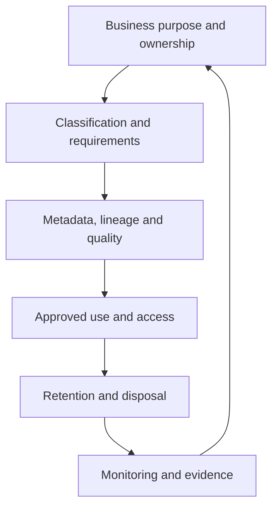

# Tool-Agnostic Data Governance Framework

[← Back to the case overview](README.md)

## 1. Purpose

This framework provides a reusable operating model for governing data throughout its lifecycle. It translates business, privacy, security, and data-management requirements into defined responsibilities, decision rules, operating procedures, controls, and evidence.

It is intentionally technology-agnostic. Organizations can implement it with different cloud providers, data catalogs, integration platforms, storage technologies, identity systems, and reporting tools.

## 2. Scope

The framework covers:

- data collection and creation;
- storage and processing;
- cataloging, metadata, and lineage;
- use and internal sharing;
- external sharing and consent;
- master and reference data;
- data quality;
- classification and access;
- retention, archival, and disposal;
- monitoring, audit evidence, and continuous improvement.

## 3. Governance principles

1. **Accountability:** every governed data asset has an accountable Data Owner.
2. **Stewardship:** metadata, definitions, and quality rules have named operational owners.
3. **Purpose limitation:** data is used only for documented and approved purposes.
4. **Least privilege:** access is limited to what each role needs.
5. **Protection by design:** classification and security requirements are considered from the beginning.
6. **Traceability:** material decisions, approvals, lineage, and control execution are auditable.
7. **Authoritative sourcing:** critical data originates from approved systems of record.
8. **Quality at source:** producers and stewards address issues as close to the origin as possible.
9. **Lifecycle control:** retention and disposal rules apply to every relevant copy and environment.
10. **Continuous improvement:** indicators, incidents, exceptions, and reviews drive remediation.

## 4. Operating model

Governance decisions move through six recurring stages:

1. Define the business purpose and accountable owner.
2. Classify the asset and identify applicable requirements.
3. Register metadata, lineage, quality rules, and authoritative sources.
4. Approve use, sharing, and access according to risk.
5. apply retention, archival, and secure-disposal rules.
6. Monitor controls, retain evidence, and improve the model.

## 5. Roles and responsibilities

| Role | Core accountability |
| --- | --- |
| Data Owner | Owns the business purpose, classification, criticality, access decisions, and acceptable use of a data asset. |
| Data Steward | Maintains definitions and metadata, coordinates data-quality rules, and manages remediation. |
| Data Custodian | Implements technical safeguards, access permissions, backup, recovery, and platform controls. |
| Data Producer | Creates or supplies data according to agreed formats, definitions, and quality expectations. |
| Data User | Uses data for approved purposes and reports suspected quality, security, or privacy issues. |
| Data Architect | Defines models, integration patterns, technical lineage, identifiers, and architecture standards. |
| Data Governance Team | Maintains the framework, standards, forums, classification model, indicators, and oversight. |
| Privacy / DPO | Advises on legal bases, data-subject rights, consent, sensitive processing, and privacy risks. |
| Information Security | Defines security requirements, monitors threats, and supports incident containment and response. |
| Internal Audit / Compliance | Assesses whether policies and controls are designed and operating as expected. |

Detailed assignments should be documented in a RACI matrix for each governance process.

## 6. Data classification

Classification connects the sensitivity and business value of an asset to its handling requirements.

### Suggested classification levels

| Level | Description | Typical handling |
| --- | --- | --- |
| Public | Approved for external disclosure. | Integrity controls and formal publication approval. |
| Internal | Intended for authorized organizational use. | Authenticated access and controlled internal sharing. |
| Confidential | Could cause material harm if disclosed or altered. | Need-to-know access, encryption, logging, and formal sharing approval. |
| Restricted | Highest-risk information, including applicable sensitive personal or regulated data. | Strictly limited access, enhanced monitoring, and documented approval. |

### Classification rules

- The Data Owner approves the classification with support from the Data Steward, Privacy, and Security when applicable.
- Access must be at least as restrictive as the classification requires.
- Unclassified assets default to an internal or more restrictive posture until reviewed.
- Downgrading a sensitive classification requires documented justification and approval.
- Classification must be reviewed when purpose, content, regulation, ownership, or risk changes.

The exact labels and handling requirements must be adapted to the organization's regulatory and risk context.

## 7. Metadata, catalog, and lineage

Every governed asset should have enough metadata to support discovery, interpretation, accountability, and control automation.

### Minimum metadata

- asset name and description;
- business domain;
- Data Owner and Data Steward;
- classification and criticality;
- approved purpose;
- applicable privacy or regulatory context;
- authoritative source;
- quality rules;
- retention rule;
- source and destination lineage;
- access group or policy;
- lifecycle status;
- last review date.

### Registration workflow

1. The Data Steward registers or reviews the asset.
2. Automated discovery enriches technical metadata where available.
3. Governance validates required fields and classification consistency.
4. The Data Architect validates material lineage and integration context.
5. The Data Owner approves the governed use of critical assets.
6. Metadata is periodically reviewed and updated.

## 8. Master and reference data

Master-data governance establishes trusted and consistent records for core business entities.

### Core controls

- Identify the approved system of record for each domain.
- Assign persistent unique identifiers to governed entities.
- Define matching and merging rules.
- Define survivorship rules for conflicting attributes.
- Prevent uncontrolled master-data creation from secondary files or replicated systems.
- Record lineage, ownership, quality status, and lifecycle status.
- Route material changes through an approved stewardship workflow.

A golden record does not mean that all data must reside in one system. It means that authoritative values and resolution rules are explicitly governed.

## 9. Data quality

Quality requirements should be tied to business use and data criticality.

### Common dimensions

| Dimension | Question |
| --- | --- |
| Completeness | Are required values present? |
| Accuracy | Does the data correctly represent the real-world object or event? |
| Validity | Does the data follow approved formats, domains, and rules? |
| Consistency | Do related systems and attributes agree? |
| Uniqueness | Are duplicate records controlled? |
| Timeliness | Is the data available within the required period? |
| Integrity | Are relationships and dependencies preserved? |

### Quality-management process

1. Define critical data elements and business rules.
2. Assign an owner for each rule and issue.
3. Establish measurable thresholds according to business impact.
4. Monitor and record exceptions.
5. Analyze root cause and prioritize remediation.
6. Validate correction and document accepted residual risk.
7. Review recurring issues through the governance forum.

Thresholds should be risk-based and configurable rather than treated as universal values.

## 10. Data lifecycle, retention, and disposal

Each data category requires a documented lifecycle rule based on purpose, contractual obligations, regulatory requirements, operational needs, and risk.

### Lifecycle flow

### Required controls

- Collect only data needed for an approved purpose.
- Apply classification and ownership at or near creation.
- Propagate retention and protection requirements to relevant copies.
- Include production, testing, analytics, backups, and archives in disposal planning.
- Use masked or synthetic data in non-production environments whenever real data is unnecessary.
- Generate evidence of approved archival or secure disposal.
- Use lineage to assess the impact of deletion, correction, or revocation requests.

Retention periods must be validated for each jurisdiction and data category; they should not be inferred from generic examples.

## 11. Access governance and security

Access decisions combine business need, classification, role, purpose, environment, and risk.

### Minimum control model

- Role-based or attribute-based access where appropriate.
- Least privilege and need-to-know access.
- Segregation of duties between incompatible activities.
- Strong authentication for privileged or sensitive access.
- Time-bound elevated access when technically feasible.
- Encryption in transit and at rest according to organizational security standards.
- Centralized logging of privileged and sensitive-data activity.
- Periodic access certification by accountable owners.
- Prompt revocation following role changes, inactivity, or loss of business need.
- Documented exception management with expiry dates.

Technical configurations, algorithms, key-rotation periods, and review frequencies must be defined through a risk assessment and applicable security standards.

## 12. Privacy, consent, and sharing

Personal-data processing must have a documented purpose and an appropriate legal basis.

### Governance workflow

1. The Data Owner defines the business purpose and required data.
2. Privacy or Legal validates the applicable requirements.
3. The Data Steward records purpose, legal context, classification, retention, and sharing conditions.
4. Collection and consent records are retained when applicable.
5. External sharing requires an approved recipient, purpose, transfer method, and contractual safeguards.
6. Revocation or data-subject requests trigger traceable assessment and action across relevant systems.
7. Completion evidence is retained according to policy.

Consent is one possible legal basis and should not be treated as universally required or universally appropriate.

## 13. Monitoring, audit, and evidence

A governance control is only sustainable when its execution and outcome can be demonstrated.

### Example indicators

| Indicator | Intended use |
| --- | --- |
| Ownership coverage | Percentage of governed assets with an assigned Data Owner. |
| Metadata completeness | Percentage of required metadata fields completed and validated. |
| Classification coverage | Percentage of in-scope assets with an approved classification. |
| Data-quality compliance | Percentage of critical rules operating within approved thresholds. |
| Issue remediation time | Time required to resolve or formally accept data issues. |
| Access-review completion | Percentage of scheduled certifications completed. |
| Access drift | Accounts or permissions inconsistent with approved need. |
| Disposal evidence coverage | Percentage of disposal events with traceable evidence. |
| Exception ageing | Open exceptions beyond their approved expiry date. |

### Minimum evidence examples

- ownership and classification approvals;
- catalog and lineage records;
- quality results and remediation tickets;
- access requests and certification decisions;
- privacy assessments and sharing approvals;
- exception records and expiry dates;
- incident and containment records;
- retention, archival, and disposal logs.

## 14. Governance forums and escalation

Governance forums should have defined decision rights rather than operate only as status meetings.

A typical forum:

- reviews critical quality, access, privacy, and lifecycle risks;
- approves standards and material exceptions;
- resolves cross-domain ownership conflicts;
- prioritizes remediation;
- monitors indicators and overdue actions;
- records decisions, owners, and due dates.

Operational issues should be resolved by the responsible roles whenever possible. Material risk, unresolved ownership, repeated noncompliance, or cross-domain conflict should be escalated.

## 15. Implementation roadmap

A phased implementation reduces complexity and creates measurable progress.

### Phase 1 — Foundation

- Confirm scope and executive sponsorship.
- Define roles, decision rights, and governance forums.
- Approve the classification model.
- Select priority domains and critical data assets.
- Establish baseline indicators.

### Phase 2 — Operationalization

- Register ownership and required metadata.
- Map key lineage and authoritative sources.
- Implement priority quality rules.
- Introduce access-review and exception workflows.
- Define retention and disposal procedures.

### Phase 3 — Scale and automation

- Expand to additional domains.
- Integrate catalog, identity, security, quality, and workflow tooling.
- Automate policy checks and evidence collection.
- Measure maturity and control effectiveness.
- Refine the roadmap based on outcomes and risk.

## 16. Success criteria

The framework is operating effectively when:

- governance decisions have named accountable owners;
- critical assets are classified and cataloged;
- users can find trusted definitions and authoritative sources;
- access aligns with classification and business need;
- priority quality issues are measured and remediated;
- retention and disposal actions are traceable;
- material exceptions are visible and time-bound;
- governance indicators influence decisions and investment.

## 17. Tailoring guidance

Before adopting this model, an organization should tailor:

- terminology and role names;
- classification levels;
- approval authorities;
- quality thresholds;
- access-review frequencies;
- retention schedules;
- evidence requirements;
- escalation criteria;
- technology integrations;
- legal and regulatory mappings.

## Disclaimer

This is an anonymized professional portfolio artifact. It is not legal advice, a certification claim, or a universal control baseline. Organizations should validate all requirements with their Legal, Privacy, Information Security, Risk, Compliance, Architecture, and business stakeholders.
