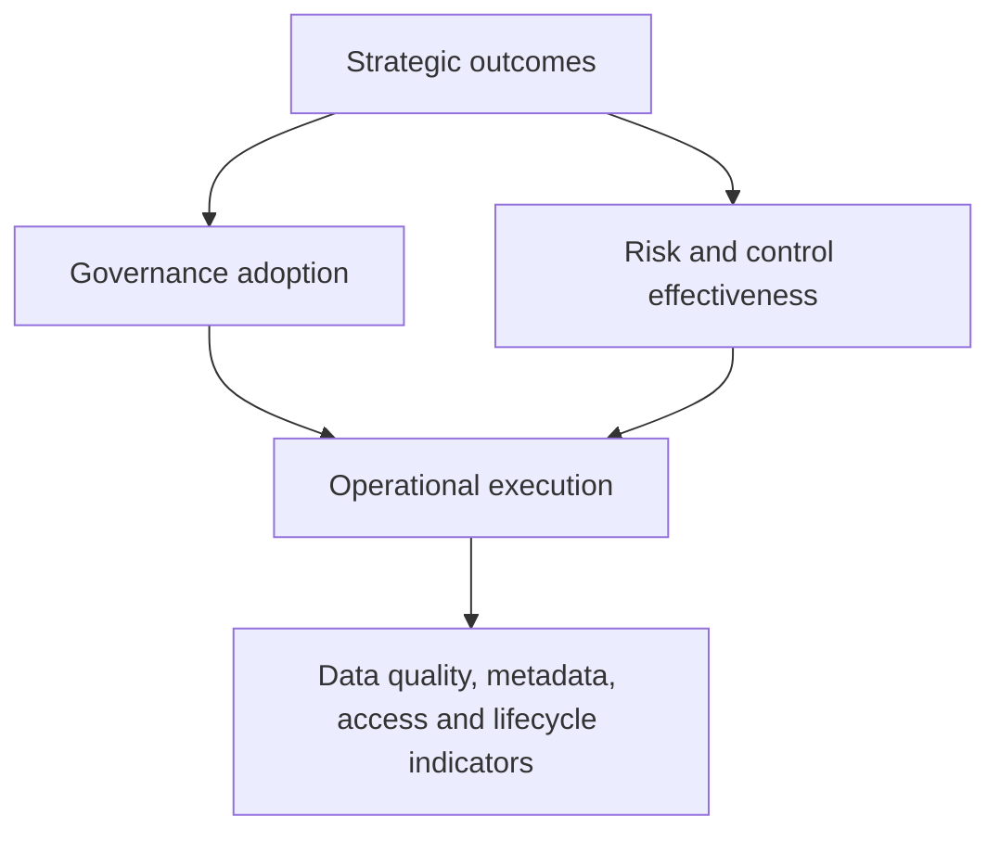
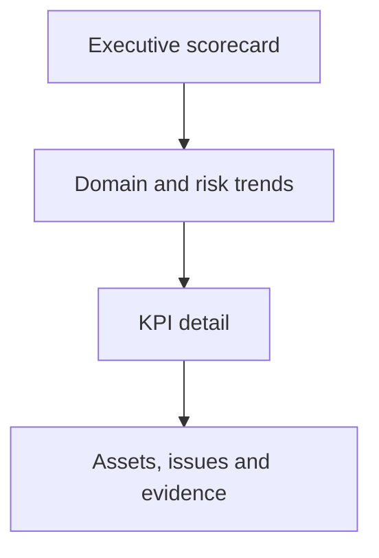

# Data Governance KPIs

[← Back to the case overview](README.md) · [Framework](framework.md) · [RACI matrix](raci-matrix.md) · [Classification matrix](data-classification-matrix.md) · [Governance lifecycle](governance-lifecycle.md)

## Purpose

This KPI catalog translates the Tool-Agnostic Data Governance Framework into measurable outcomes. It supports operational monitoring, governance forums, risk escalation, roadmap prioritization, and continuous improvement.

The examples below are configurable. Targets, thresholds, frequencies, and system sources must be adapted to the organization's baseline, risk appetite, maturity, and regulatory context.

## Measurement principles

1. **Tie each KPI to a decision.** A metric without an owner or response does not create governance value.
2. **Define numerator and denominator.** Percentages must identify the exact in-scope population.
3. **Separate coverage from effectiveness.** A completed control may still be ineffective.
4. **Use trends and segmentation.** A portfolio average can hide risk in a critical domain.
5. **Preserve evidence.** Results should be reproducible from approved sources.
6. **Avoid vanity metrics.** Counting policies or meetings is insufficient without adoption or outcomes.
7. **Document exclusions.** Scope changes must not silently improve or reduce performance.
8. **Review targets.** Thresholds should evolve as governance maturity improves.

## KPI hierarchy



## KPI summary

| ID | KPI | Dimension | Primary owner | Suggested frequency |
| --- | --- | --- | --- | --- |
| GOV-01 | Governed asset coverage | Adoption | Data Governance Office | Monthly |
| GOV-02 | Ownership coverage | Accountability | Data Governance Office | Monthly |
| GOV-03 | Governance action closure | Execution | Data Governance Office | Monthly |
| META-01 | Required metadata completeness | Metadata | Data Steward | Weekly or monthly |
| META-02 | Classification coverage | Classification | Data Owner | Monthly |
| META-03 | Lineage coverage | Metadata / Architecture | Data Architect | Monthly |
| DQ-01 | Critical rule compliance | Data quality | Data Owner | Daily, weekly, or monthly |
| DQ-02 | Data-quality issue resolution time | Data quality | Data Steward | Monthly |
| DQ-03 | Recurring data-quality issue rate | Data quality | Data Steward | Monthly |
| IAM-01 | Access-review completion | Access governance | Data Owner | Per review cycle |
| IAM-02 | Access drift rate | Access governance | Data Custodian | Weekly or monthly |
| IAM-03 | Privileged-access removal time | Access governance | Information Security | Monthly |
| LIFE-01 | Retention-rule coverage | Lifecycle | Data Owner | Monthly |
| LIFE-02 | Disposal evidence coverage | Lifecycle | Data Custodian | Monthly |
| PRIV-01 | Purpose and legal-context coverage | Privacy | Privacy / DPO | Monthly |
| EXC-01 | Expired exception rate | Risk | Data Governance Office | Weekly or monthly |
| RISK-01 | Governance risk remediation time | Risk | Data Owner | Monthly |

## 1. Governance adoption and accountability

### GOV-01 — Governed asset coverage

Measures how much of the defined data scope has entered the governance lifecycle.

```text
Governed asset coverage (%) =
(Number of in-scope assets with active governance records
÷ Total number of identified in-scope assets) × 100
```

| Attribute | Definition |
| --- | --- |
| Decision supported | Whether governance rollout is reaching the planned scope. |
| Suggested segmentation | Domain, system, classification, criticality, lifecycle status. |
| Evidence | Asset inventory and governance catalog. |
| Watch condition | Coverage is stagnant, declining, or excludes critical assets. |
| Typical action | Confirm scope, assign ownership, and prioritize onboarding. |

### GOV-02 — Ownership coverage

Measures whether governed assets have an approved accountable Data Owner.

```text
Ownership coverage (%) =
(Assets with an active approved Data Owner
÷ Total governed assets requiring ownership) × 100
```

An owner field containing a placeholder, inactive person, generic mailbox, or unresolved group should not count as valid ownership unless formally approved by the operating model.

### GOV-03 — Governance action closure

Measures whether decisions and remediation actions are completed within their agreed due dates.

```text
On-time action closure (%) =
(Actions completed by the agreed due date
÷ Actions due during the measurement period) × 100
```

Track overdue actions separately by age, criticality, owner, and governance domain.

## 2. Metadata, classification, and lineage

### META-01 — Required metadata completeness

Measures completion of mandatory metadata fields for governed assets.

```text
Metadata completeness (%) =
(Valid required metadata fields
÷ Total required metadata fields for in-scope assets) × 100
```

A populated value should be counted only when it passes defined validity rules. For example, an assigned owner must be active and a classification must use an approved value.

### META-02 — Classification coverage

Measures whether assets have current, approved classifications.

```text
Classification coverage (%) =
(Assets with approved and current classifications
÷ Assets requiring classification) × 100
```

Recommended companion indicators:

- overdue classification reviews;
- unclassified critical assets;
- classification downgrades;
- assets whose technical access is weaker than their classification requirement.

### META-03 — Lineage coverage

Measures whether required source-to-destination lineage is available for critical assets.

```text
Lineage coverage (%) =
(Critical assets with validated required lineage
÷ Critical assets requiring lineage) × 100
```

Coverage criteria should define the required depth: source only, source-to-report, field-level, transformation-level, or another approved standard.

## 3. Data quality

### DQ-01 — Critical rule compliance

Measures how consistently critical data-quality rules operate within approved thresholds.

```text
Critical rule compliance (%) =
(Critical quality checks meeting their approved threshold
÷ Critical quality checks executed) × 100
```

Report results by quality dimension, data domain, asset, source system, severity, and business process.

### DQ-02 — Data-quality issue resolution time

Measures elapsed time from confirmed issue creation to validated closure.

```text
Resolution time =
Validated closure timestamp − Confirmed issue timestamp
```

Use median and percentile results in addition to the mean because a small number of long-running issues can distort averages.

Useful breakdowns:

- severity;
- root cause;
- business domain;
- Data Owner;
- source system;
- recurring versus first occurrence.

### DQ-03 — Recurring data-quality issue rate

Measures whether previously resolved causes continue to generate incidents.

```text
Recurring issue rate (%) =
(Confirmed issues linked to a previously known root cause
÷ Total confirmed quality issues) × 100
```

A high recurrence rate may indicate that teams are correcting records without resolving upstream process or system causes.

## 4. Access governance and security

### IAM-01 — Access-review completion

Measures execution of required access-certification cycles.

```text
Access-review completion (%) =
(Access decisions completed by the deadline
÷ Access decisions scheduled for the review cycle) × 100
```

Track completion separately from effectiveness. A fully completed review can still be ineffective if reviewers approve access without sufficient context.

Suggested effectiveness measures:

- percentage of reviewed access that was revoked or adjusted;
- percentage of reviewers who received complete ownership, purpose, and activity context;
- percentage of revocation decisions technically completed within the required period.

### IAM-02 — Access drift rate

Measures active access that does not match approved ownership, role, purpose, classification, or employment status.

```text
Access drift rate (%) =
(Active access assignments failing approved rules
÷ Total active access assignments evaluated) × 100
```

Examples include inactive users, excessive privilege, expired temporary access, orphaned accounts, and access outside an approved group.

### IAM-03 — Privileged-access removal time

Measures the time between a revocation trigger and verified technical removal.

```text
Removal time =
Verified access removal timestamp − Revocation trigger timestamp
```

Possible triggers include role change, termination, expired approval, incident containment, or Data Owner decision.

## 5. Lifecycle, retention, and disposal

### LIFE-01 — Retention-rule coverage

Measures whether governed assets have approved retention requirements.

```text
Retention-rule coverage (%) =
(Assets with approved and mapped retention rules
÷ Assets requiring retention rules) × 100
```

A generic or undocumented period should not count as valid. The rule should identify the trigger, duration or decision basis, responsible role, disposition action, and applicable exception process.

### LIFE-02 — Disposal evidence coverage

Measures whether completed disposal events have verifiable evidence.

```text
Disposal evidence coverage (%) =
(Completed disposal events with validated evidence
÷ Total completed disposal events requiring evidence) × 100
```

Evidence can include approved scope, execution logs, verification results, affected systems, exception records, and accountable approval.

## 6. Privacy and purpose

### PRIV-01 — Purpose and legal-context coverage

Measures whether relevant assets document their purpose and applicable privacy context.

```text
Purpose and legal-context coverage (%) =
(Relevant assets with validated purpose and required privacy metadata
÷ Total relevant assets in scope) × 100
```

This KPI should not assume that consent is always the applicable legal basis. Validation belongs to authorized Privacy or Legal roles.

Useful companion indicators:

- purpose changes awaiting reassessment;
- external shares without current approval;
- privacy requests outside the required response period;
- relevant assets without approved retention rules;
- personal data detected in unapproved non-production environments.

## 7. Exceptions and governance risk

### EXC-01 — Expired exception rate

Measures exceptions that remain open after their approved expiry date.

```text
Expired exception rate (%) =
(Open exceptions past their expiry date
÷ Total open exceptions) × 100
```

Also monitor:

- exceptions without an accountable owner;
- exceptions without compensating controls;
- repeated renewals;
- residual risk by severity;
- remediation progress.

### RISK-01 — Governance risk remediation time

Measures time from formal acceptance of a governance risk for action to validated remediation.

```text
Remediation time =
Validated remediation timestamp − Risk action start timestamp
```

Report by severity and use target ranges appropriate to the organization's risk model.

## KPI specification template

Every production KPI should have a maintained specification:

| Field | Description |
| --- | --- |
| KPI name and ID | Stable name and identifier. |
| Business question | Decision the KPI supports. |
| Definition | Precise description of what is measured. |
| Formula | Numerator, denominator, aggregation, and units. |
| Scope | Included assets, domains, systems, periods, and exclusions. |
| Source | Approved systems, tables, reports, or evidence. |
| Data owner | Accountable owner of the source data. |
| KPI owner | Role accountable for interpretation and action. |
| Frequency | Calculation and reporting cadence. |
| Target | Desired performance for the period. |
| Watch threshold | Condition requiring analysis or escalation. |
| Segmentation | Required drill-down dimensions. |
| Response | Expected action when the threshold is missed. |
| Evidence | Record retained to support the result. |
| Limitations | Known assumptions, gaps, latency, or quality concerns. |
| Version | Current definition and approval history. |

## Example status model

Targets should be established from risk and baseline evidence. The following is only an illustrative structure:

| Status | Interpretation | Required response |
| --- | --- | --- |
| **Green** | Meets the approved target. | Continue monitoring and improvement. |
| **Amber** | Within the approved attention range or declining materially. | Analyze cause, assign action, and monitor recovery. |
| **Red** | Breaches the approved threshold or creates material risk. | Escalate, remediate, and document the decision. |
| **Grey** | Insufficient or invalid data. | Resolve measurement or source-data gaps before drawing conclusions. |

Grey must not be treated as green. Missing evidence is a governance issue, not proof that a control is effective.

## Dashboard design

A governance dashboard should move from executive outcomes to operational detail.



### Recommended views

1. **Executive summary** — strategic KPIs, trends, red indicators, and required decisions.
2. **Domain comparison** — performance by business domain, owner, criticality, and classification.
3. **Metadata and classification** — coverage, validity, lineage, and overdue reviews.
4. **Data quality** — critical rules, issue severity, root cause, and remediation.
5. **Access and privacy** — certifications, drift, privileged removal, and purpose coverage.
6. **Lifecycle and exceptions** — retention, disposal, open exceptions, expiry, and residual risk.
7. **Evidence detail** — traceable records supporting the summarized result.

## Review cadence

| Forum | Focus | Typical cadence |
| --- | --- | --- |
| Operational working group | Exceptions, quality issues, incomplete metadata, and overdue actions. | Weekly or biweekly |
| Domain governance forum | Domain trends, ownership, access, priorities, and remediation. | Monthly |
| Enterprise governance council | Material risk, cross-domain decisions, investment, and policy. | Monthly or quarterly |
| Independent assurance | Control design and operating effectiveness. | Risk-based audit cycle |

Cadence should reflect risk and operating needs rather than a fixed universal schedule.

## Anti-patterns

Avoid:

- percentages with undefined denominators;
- manually altered results without documented controls;
- changing scope without restating the historical baseline;
- reporting only portfolio averages;
- treating missing data as compliant;
- counting documents or meetings as evidence of effectiveness;
- targets selected only because current results already meet them;
- duplicate KPIs with inconsistent formulas;
- metrics without named owners or response actions;
- presenting correlation as root cause.

## Implementation sequence

1. Select a small group of decision-relevant KPIs.
2. Approve definitions, scope, owners, and sources.
3. Assess source-data quality and evidence availability.
4. Establish a baseline before setting improvement targets.
5. Build reproducible calculations.
6. Validate results with Data Owners and control operators.
7. Publish trends and required actions.
8. Review definitions after process, system, scope, or risk changes.
9. Add indicators only when they support a clear decision.

## Disclaimer

This KPI catalog is an anonymized professional portfolio artifact. Example measures, frequencies, and status logic are configurable and do not represent universal legal, regulatory, contractual, or security requirements.
