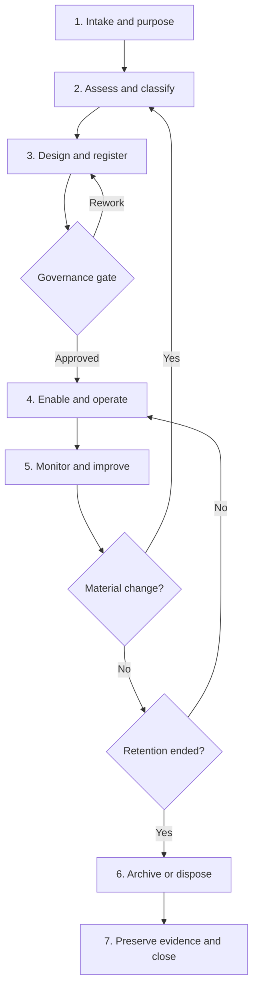
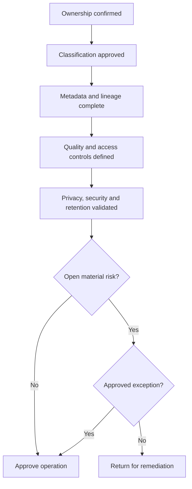
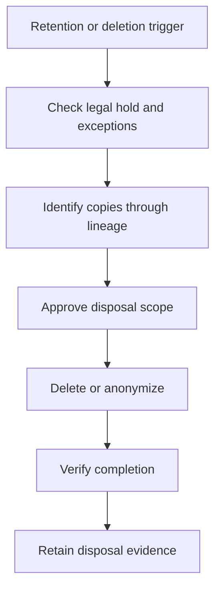

# Data Governance Lifecycle

[← Back to the case overview](README.md) · [Framework](framework.md) · [RACI matrix](raci-matrix.md) · [Classification matrix](data-classification-matrix.md)

## Purpose

This lifecycle defines how a data asset moves from initial business need through governance assessment, controlled use, monitoring, change, retention, and defensible disposal.

It applies governance throughout the asset's existence rather than treating governance as a one-time approval.

## Lifecycle overview



## Lifecycle stages

| Stage | Objective | Key activities | Primary accountability | Minimum evidence |
| --- | --- | --- | --- | --- |
| **1. Intake and purpose** | Establish why the data is needed and who owns it. | Define purpose, scope, users, sources, expected value, and Data Owner. | Data Owner | Intake record, purpose statement, ownership assignment. |
| **2. Assess and classify** | Determine sensitivity, criticality, privacy, security, and regulatory needs. | Identify data categories, assess impact, classify the asset, and identify obligations. | Data Owner | Classification decision, risk assessment, applicable-requirements record. |
| **3. Design and register** | Build governance requirements into the asset before use. | Define metadata, lineage, quality rules, access model, retention, authoritative source, and architecture. | Data Owner | Catalog record, lineage, quality rules, access design, retention rule. |
| **Governance gate** | Confirm that minimum requirements are complete and approved. | Validate ownership, classification, metadata, controls, approvals, exceptions, and evidence. | Data Owner | Approval, exception record, or documented rework decision. |
| **4. Enable and operate** | Make the asset available for approved use. | Implement access, publish metadata, activate monitoring, and communicate usage conditions. | Data Owner | Access records, active catalog entry, operating procedures, user conditions. |
| **5. Monitor and improve** | Maintain trust, compliance, and control effectiveness. | Monitor quality, access, metadata, incidents, exceptions, usage, and remediation. | Data Owner | KPI results, access reviews, issue logs, remediation and review records. |
| **6. Archive or dispose** | Apply approved end-of-life requirements. | Validate retention, restrict use, archive when required, delete relevant copies, and verify completion. | Data Owner | Archival record or secure-disposal evidence. |
| **7. Preserve evidence and close** | Demonstrate that governance obligations were completed. | Retain decisions and evidence, close access, update the catalog, and record lessons learned. | Data Governance Office | Closure record, final evidence package, catalog status update. |

## 1. Intake and purpose

The lifecycle begins when data is created, acquired, integrated, materially transformed, or proposed for a new use.

### Required questions

- What business outcome requires the data?
- Which data is necessary for that purpose?
- Who is accountable for the asset?
- Who produces, stewards, stores, and uses it?
- Is the data new, copied, purchased, shared, or derived?
- Which people, systems, domains, or external parties are involved?
- What would happen if the data were unavailable, incorrect, altered, or disclosed?

### Exit criteria

- A Data Owner is assigned.
- The business purpose and scope are documented.
- Key stakeholders and intended users are identified.
- The asset is accepted for governance assessment.

## 2. Assess and classify

The asset is evaluated before controls and access are designed.

### Assessment areas

| Area | Assessment |
| --- | --- |
| Sensitivity | Public, Internal, Confidential, or Restricted. |
| Data categories | Personal, financial, commercial, security, intellectual property, operational, or other applicable categories. |
| Criticality | Business impact of unavailable, inaccurate, incomplete, or delayed data. |
| Privacy | Purpose, legal context, data-subject impact, sharing, and retention requirements. |
| Security | Threats, exposure, privileged access, environment, and protection needs. |
| Regulatory and contractual context | Applicable laws, policies, contracts, and industry requirements. |
| Aggregation and lineage | Risk created by combining datasets or propagating data downstream. |

Use the [Data Classification Matrix](data-classification-matrix.md) as the baseline.

### Exit criteria

- Classification is approved.
- Applicable requirements and risks are recorded.
- Required specialist reviews are identified.
- Unresolved risks are assigned for treatment.

## 3. Design and register

Governance requirements are translated into an operating and technical design.

### Required design elements

- business and technical metadata;
- ownership and stewardship assignments;
- authoritative source;
- conceptual and technical lineage;
- critical data elements;
- quality rules and thresholds;
- access roles or attributes;
- sharing conditions;
- retention and disposal rules;
- monitoring and evidence requirements;
- exception and escalation paths.

### Minimum catalog record

```text
Asset name
Business description
Business domain
Data Owner
Data Steward
Classification
Data categories
Approved purpose
Authoritative source
Critical data elements
Quality rules
Lineage
Access posture
Retention rule
Applicable requirements
Review date
Lifecycle status
```

### Exit criteria

- Required metadata is complete.
- Lineage is sufficient for the approved use and risk.
- Access and protection requirements match the classification.
- Quality requirements have owners and monitoring plans.
- Retention and disposal requirements are assigned.
- Open exceptions are documented and approved.

## Governance gate

The governance gate determines whether the asset can move into approved operation.



### Gate decision

| Decision | Meaning |
| --- | --- |
| Approved | Minimum requirements are met and the asset can operate. |
| Conditionally approved | A time-bound exception and compensating controls are accepted. |
| Rework required | Gaps must be resolved before operation. |
| Rejected | The proposed use exceeds the accepted risk or lacks an appropriate purpose. |

A gate should not become a paperwork-only checkpoint. The approver must be able to trace the decision to current evidence.

## 4. Enable and operate

After approval, the asset is made available according to its governed design.

### Operating activities

- Implement approved access groups, roles, or attributes.
- Confirm segregation of duties and privileged-access safeguards.
- Publish the governed metadata record.
- Activate quality, security, and usage monitoring.
- Communicate acceptable-use and sharing conditions.
- Validate downstream propagation of classification and retention requirements.
- Record the operational start date and next review.

### Exit criteria

Operation is not a terminal stage. The asset remains in this stage while controls operate and monitoring evidence is produced.

## 5. Monitor and improve

Governance must respond to control results and business change.

### Monitoring domains

| Domain | Example indicators |
| --- | --- |
| Ownership and metadata | Ownership coverage, metadata completeness, overdue reviews. |
| Data quality | Rule compliance, issue volume, remediation time, recurring root causes. |
| Access | Access-review completion, inactive access, privilege drift, exceptions. |
| Privacy | Purpose changes, requests, consent status where applicable, unauthorized use. |
| Security | Sensitive-data events, privileged activity, incidents, containment time. |
| Lifecycle | Retention exceptions, archival status, disposal-evidence coverage. |
| Governance | Open decisions, overdue actions, exception ageing, policy adoption. |

### Trigger events

A new assessment is required when there is:

- a new purpose or user group;
- a new source, destination, or external recipient;
- a material schema or content change;
- a change in classification or criticality;
- aggregation that changes privacy or business risk;
- a new platform, environment, or jurisdiction;
- a security or privacy incident;
- a quality failure with material business impact;
- a relevant legal, contractual, or policy change;
- an expired exception.

Material changes return the asset to **Assess and classify**, followed by updated design and approval.

## 6. Archive or dispose

When the approved purpose ends or a retention trigger occurs, the Data Owner confirms the appropriate end-of-life action.

### Archive

Archive when information must remain available but should no longer be actively processed.

Required considerations:

- continued classification and access restriction;
- integrity and readability for the required period;
- location and ownership of the archive;
- encryption and key availability;
- legal hold or investigation requirements;
- final disposal trigger.

### Dispose

Disposal should address relevant copies and derived records according to approved scope.



Potential locations include:

- production systems;
- analytics and reporting layers;
- integration and staging zones;
- test and development environments;
- approved exports and shared files;
- archives and backups, according to feasible disposal controls.

### Exit criteria

- The accountable owner approved the action.
- Legal holds and active exceptions were checked.
- Relevant locations were identified.
- Disposal or anonymization was completed and verified.
- Access and scheduled processing were terminated.
- Required evidence was retained.

## 7. Preserve evidence and close

Closure confirms that the asset is no longer active and that its governance history remains defensible.

### Closure package

- original purpose and ownership;
- classification history;
- material approvals and exceptions;
- access and review history;
- quality and remediation records;
- privacy and security decisions;
- archival or disposal evidence;
- final catalog status;
- unresolved dependencies or retained records;
- lessons learned.

The catalog status should clearly distinguish assets that are active, archived, retired, or disposed.

## Roles across the lifecycle

| Role | Lifecycle contribution |
| --- | --- |
| Data Owner | Accountable for purpose, classification, acceptable use, access, risk, retention, and end-of-life decisions. |
| Data Steward | Coordinates metadata, quality, classification analysis, reviews, and remediation. |
| Data Producer | Provides source context and resolves issues originating in data creation. |
| Data Custodian | Implements access, protection, monitoring, archival, and disposal controls. |
| Data Architect | Defines models, lineage, integration, and technical propagation requirements. |
| Privacy / DPO | Advises on personal-data processing, rights, sharing, retention, and privacy risk. |
| Information Security | Defines security requirements and supports monitoring and incident response. |
| Data Governance Office | Maintains the lifecycle, validates governance completeness, monitors indicators, and coordinates escalation. |
| Audit / Compliance | Independently evaluates whether controls are designed and operating effectively. |
| Data User | Uses the asset within approved conditions and reports quality or control issues. |

Detailed assignments are available in the [Data Governance RACI Matrix](raci-matrix.md).

## Lifecycle status model

| Status | Meaning |
| --- | --- |
| Proposed | Business need submitted; ownership or scope may still be under definition. |
| Under assessment | Classification, risk, and applicable requirements are being evaluated. |
| In design | Metadata, quality, access, lineage, and lifecycle controls are being defined. |
| Pending approval | Minimum evidence is ready for the governance gate. |
| Active | Approved for governed use and under monitoring. |
| Conditionally active | Operating under a time-bound approved exception. |
| Under review | Material change or scheduled review is in progress. |
| Archived | No longer actively used but retained under controlled conditions. |
| Retired | Processing has stopped and closure activities are underway or complete. |
| Disposed | Approved disposal is complete and evidence is retained. |

## Lifecycle indicators

- percentage of proposed assets with an assigned Data Owner;
- average time from intake to governance approval;
- percentage of active assets with complete required metadata;
- percentage of active assets with current classification reviews;
- number and age of conditional approvals;
- percentage of critical assets with monitored quality rules;
- percentage of completed access reviews;
- number of material changes awaiting reassessment;
- percentage of end-of-life assets processed within the required period;
- percentage of disposal events with verified evidence.

## Tailoring guidance

Organizations should adapt:

- lifecycle stages and status names;
- governance-gate criteria;
- decision authorities;
- risk and criticality scales;
- review frequencies;
- exception workflows;
- evidence requirements;
- catalog metadata;
- archival and disposal methods;
- integrations with workflow, catalog, identity, security, privacy, and service-management tools.

## Disclaimer

This lifecycle is an anonymized professional portfolio artifact and a configurable governance baseline. It does not replace legal, privacy, security, records-management, architecture, or regulatory assessment. Requirements must be validated for each organization's context.
