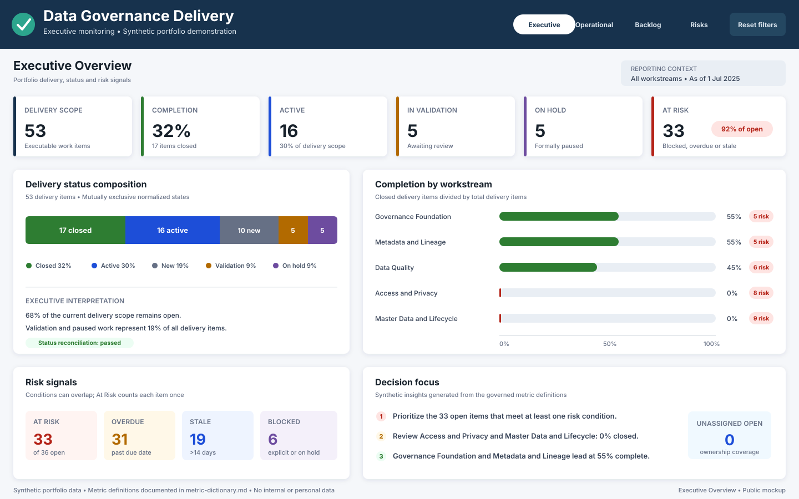
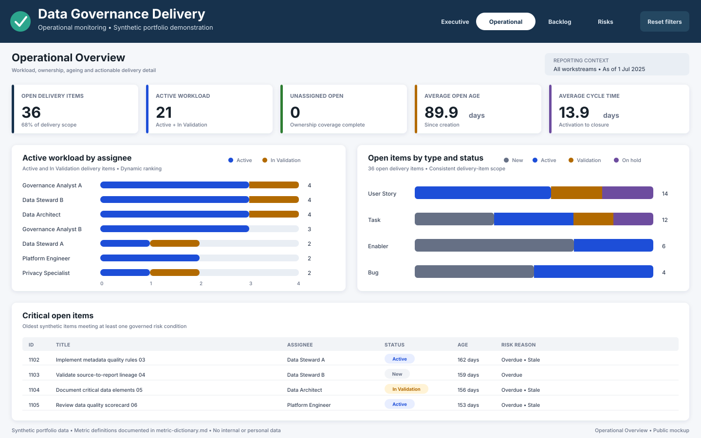
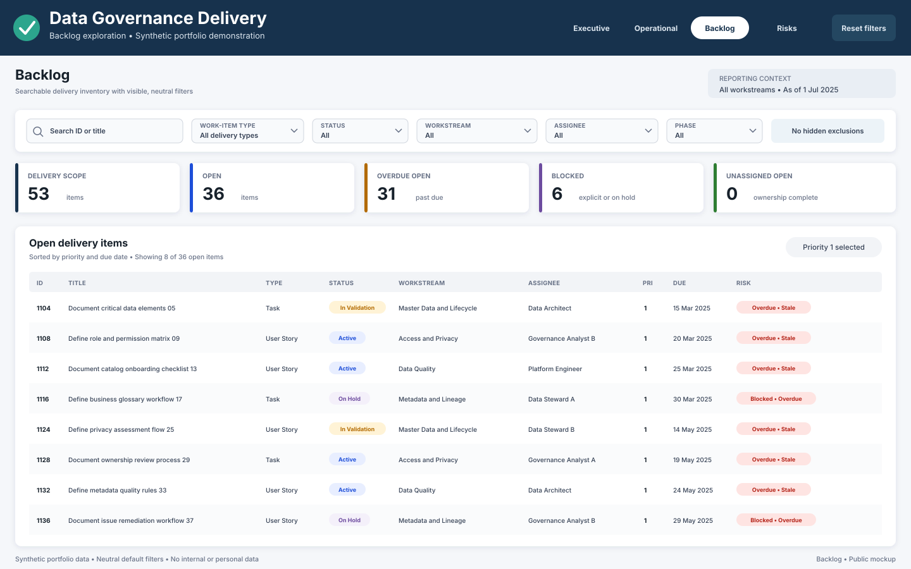
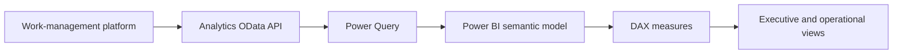
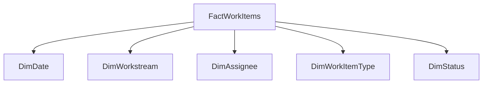

# Data Governance Delivery Dashboard

> A Power BI delivery-monitoring solution that translates work-management data into executive governance visibility, operational follow-up, and actionable risk indicators.

## Overview

This case presents a delivery dashboard designed to monitor the implementation of a Data Governance program. The solution connects Power BI to work-item data from Azure DevOps Analytics and organizes execution information into executive, operational, and backlog views.

The public case is anonymized. Names, organizations, project identifiers, internal URLs, and business-sensitive records from the original implementation are not included.

## Business challenge

Data Governance programs usually span policies, metadata, data quality, privacy, access, lifecycle, architecture, and multiple business domains. When delivery information remains only in a work-management tool, leaders may struggle to answer:

- How much of the governance roadmap has been delivered?
- Which initiatives are active, completed, paused, or awaiting validation?
- Where are the main delivery risks and bottlenecks?
- Which teams or workstreams require attention?
- Who is carrying the highest active workload?
- Are metric definitions consistent across executive and operational views?

## Solution

The dashboard converts work-item data into a governed monitoring layer with:

- executive delivery indicators;
- progress and status distribution;
- workstream or squad comparison;
- operational workload analysis;
- backlog search and filtering;
- ownership visibility;
- risk and ageing indicators;
- documented business rules and release controls.

## Solution architecture

The original solution uses an Azure DevOps Analytics OData feed in import mode. The public portfolio version will use synthetic data and parameterized source references.

## Dashboard views

| View | Purpose |
| --- | --- |
| Landing page | Introduces the solution and provides report navigation. |
| Executive overview | Summarizes volume, completion, active work, validation, paused items, risk, and workstream health. |
| Operational overview | Supports analysis by assignee, work-item type, status, workstream, and delivery condition. |
| Backlog | Provides searchable work-item detail and filtering by type, status, and workstream. |
| Risks and bottlenecks | Planned public view for ageing, blocked work, missing ownership, prolonged validation, and critical items. |

## Core indicators

| Indicator | Business question |
| --- | --- |
| Total work items | What is the total delivery scope represented in the model? |
| Completion rate | What percentage of the defined scope is completed? |
| Active items | How much work is currently in progress? |
| In validation | Which items are waiting for review or acceptance? |
| On hold | Which items are formally paused? |
| At-risk items | Which active items exceed the approved ageing or inactivity rule? |
| Workstream progress | How does delivery performance vary across workstreams? |
| Workload by assignee | How is active work distributed across responsible roles? |
| Backlog composition | Which types and states make up the current portfolio? |

Metric definitions must use consistent work-item scopes, normalized statuses, and explicit denominators.

## Data model

The assessed implementation contains:

| Component | Assessed template |
| --- | ---: |
| Report pages | 5 |
| Visible pages | 4 |
| Visual elements | 53 |
| DAX measures | 42 |
| Model tables | 11 |
| Relationships | 9 |
| Custom visuals | 1 |

The public redesign recommends a simplified star schema:

This structure reduces duplicated logic and supports clearer filtering, testing, and measure maintenance.

## Data preparation

The transformation layer is responsible for:

- selecting only required work-item fields;
- expanding iteration and assignee attributes;
- standardizing text and null values;
- deriving workstream and phase attributes;
- normalizing workflow states;
- supporting ageing and risk calculations;
- preserving identifiers required for validation;
- keeping source parameters outside hard-coded public artifacts.

A single governed status mapping should be used across every table and measure.

### Example normalized status model

| Source state example | Normalized status |
| --- | --- |
| New, To Do | New |
| Active, Doing | Active |
| Resolved, In Validation | In Validation |
| On Hold | On Hold |
| Closed, Done | Closed |
| Removed | Excluded or Closed, according to the approved business rule |
| Unknown or unmapped | Other |

## Business-rule controls

The dashboard design applies the following controls:

- Numerators and denominators must use compatible work-item scopes.
- Completion percentages must state which work-item types are included.
- Risk logic must distinguish ageing from lack of recent activity.
- Paused items must not be counted as active risk unless the rule explicitly requires it.
- Workstream names and phase tags must use controlled mappings.
- Unassigned work must remain visible as a monitored category.
- Default page filters must be neutral or clearly disclosed.
- Rankings must update dynamically instead of relying on fixed names.
- Status mappings must be maintained in one controlled rule set.

## Technical assessment findings

The technical-functional review identified opportunities to improve reliability and maintainability:

| Finding | Potential impact | Recommended treatment |
| --- | --- | --- |
| Two imported tables query the same work-item entity. | Duplicate processing and more complex maintenance. | Consolidate into one fact table with explicit dimensions. |
| Status is normalized through different rules. | The same item can appear in conflicting categories. | Create one controlled status-mapping table or transformation. |
| Some visuals use fixed assignee selections. | New or removed assignees may be excluded or retained incorrectly. | Replace fixed selections with dynamic ranking and neutral filters. |
| Active-item measures use different work-item scopes. | Executive and operational totals may not reconcile. | Define a shared scope and reusable base measures. |
| Risk terminology differs between inactivity and activation-age logic. | Users may misinterpret delayed or at-risk work. | Approve one definition and align names, DAX, and documentation. |
| Backlog pages open with saved filters. | Users may assume excluded work does not exist. | Use a neutral default and provide a clear reset-filters action. |
| Risks and bottlenecks view is not implemented. | Critical issues require manual investigation. | Add risk cards, ageing analysis, exception detail, and owner/workstream views. |
| Refresh and workspace controls cannot be validated from the template alone. | File inspection may be mistaken for service assurance. | Maintain separate deployment, access, refresh, and release evidence. |

## My contribution

- Structured the dashboard around executive and operational governance needs.
- Translated work-management data into delivery and risk indicators.
- Defined report pages, measures, filters, and navigation requirements.
- Documented Power Query, semantic-model, and DAX behavior.
- Assessed metric consistency and identified technical debt.
- Defined recommended architecture and business-rule improvements.
- Created operational monitoring, troubleshooting, and release-validation guidance.
- Applied privacy-aware publication criteria for the portfolio version.

## Skills demonstrated

- Power BI report design
- Power Query and data transformation
- DAX measure design and validation
- Semantic modeling
- Azure DevOps Analytics and OData
- KPI definition and reconciliation
- Data-quality controls
- Technical-functional documentation
- Dashboard governance and release management
- Privacy-aware data anonymization

## Public portfolio safeguards

The following materials will not be published in their original form:

- the source workbook containing real work-item titles and assignee names;
- internal organization or project URLs;
- company or client branding;
- credentials, workspace settings, or access information;
- screenshots containing identifiable delivery data;
- the original Power BI template while internal references remain embedded.

The portfolio version will use synthetic work items, generic workstreams, fictional assignees, and parameterized source settings.

## Published artifacts

- [Synthetic delivery work-item dataset](data/synthetic-work-items.csv)
- [Delivery Dashboard Metric Dictionary](metric-dictionary.md)
- [Delivery Dashboard Semantic Model](semantic-model.md)
- [Delivery Dashboard Data Preparation](data-preparation.md)
- [Delivery Dashboard Release Checklist](release-checklist.md)
- [Public Dashboard Design Specification](dashboard-design.md)
- [Synthetic Executive Overview Mockup](../../assets/delivery-executive-overview.svg)
- [Synthetic Operational Overview Mockup](../../assets/delivery-operational-overview.svg)
- [Synthetic Delivery Backlog Mockup](../../assets/delivery-backlog.svg)

## Planned public artifacts

- public dashboard screenshots;
- sanitized Power BI template, after full inspection and testing.

## Important note

This case documents an anonymized professional solution and technical assessment. Dashboard values, targets, risk thresholds, names, and workstreams in the public version are illustrative and must not be interpreted as internal organizational results.
