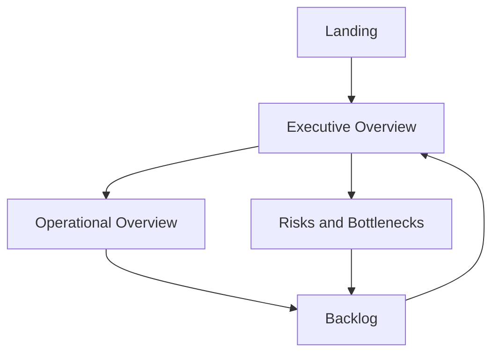

# Delivery Dashboard Design

[← Back to the case overview](README.md) · [Synthetic dataset](data/synthetic-work-items.csv) · [Metric dictionary](metric-dictionary.md) · [Semantic model](semantic-model.md) · [Data preparation](data-preparation.md) · [Release checklist](release-checklist.md)

## Purpose

This document defines the public report experience for the Data Governance Delivery Dashboard.

The design uses only synthetic data and a neutral visual identity. It translates the governed semantic model and metric dictionary into five report pages:

1. Landing
2. Executive Overview
3. Operational Overview
4. Backlog
5. Risks and Bottlenecks

## Design principles

- Lead with decisions, not with the number of available charts.
- Keep executive and operational scopes consistent.
- Make filters and current context visible.
- Allow every summary risk indicator to reach item-level detail.
- Use color and text together to communicate status.
- Distinguish zero, blank, unavailable, and not applicable.
- Avoid fixed names, hidden default filters, and decorative complexity.
- Design for keyboard navigation, legibility, and color-vision accessibility.
- Use the same vocabulary as the metric dictionary.
- Keep the public version independent of company branding.

## Navigation

A persistent page navigator should appear in a consistent location on every analytical page. A visible **Reset filters** action should restore the approved neutral state.

## Canvas and grid

| Property | Recommendation |
| --- | --- |
| Canvas | 16:9 widescreen |
| Reference size | 1280 × 720 |
| Outer margin | 24 px |
| Grid | 12 columns |
| Horizontal gutter | 16 px |
| Section spacing | 16–24 px |
| Card corner radius | 6–8 px |
| Minimum body text | 11–12 pt |
| Minimum card label | 11 pt |
| Primary page title | 22–28 pt |
| Visual title | 12–14 pt |

The landing page may use a taller hero area, but analytical pages should keep the same header, filter, content, and footer structure.

## Visual identity

### Neutral public palette

| Purpose | Color | Hex |
| --- | --- | --- |
| Primary navigation | Navy | `#17324D` |
| Active / informational | Blue | `#1D4ED8` |
| Completed / healthy | Green | `#2E7D32` |
| In validation / attention | Amber | `#B26A00` |
| On hold | Purple | `#6D4C9F` |
| Risk / overdue | Red | `#B42318` |
| New / neutral | Slate | `#667085` |
| Page background | Light grey | `#F5F7FA` |
| Card background | White | `#FFFFFF` |
| Primary text | Near black | `#17212B` |
| Secondary text | Dark grey | `#475467` |

### Status mapping

| Status | Color | Additional cue |
| --- | --- | --- |
| New | Slate | Circle icon or “New” label |
| Active | Blue | Play or activity icon |
| In Validation | Amber | Review icon |
| On Hold | Purple | Pause icon |
| Closed | Green | Check icon |
| At Risk | Red | Warning icon |
| Other | Dark grey | Question or exception icon |

Color must never be the only status indicator.

## Global page structure

| Zone | Content |
| --- | --- |
| Header | Page title, short purpose, last refresh, and navigation. |
| Filter bar | Workstream, phase, work-item type, status, assignee, and date context as applicable. |
| Summary area | Decision-relevant cards or alerts. |
| Analysis area | Trends, comparisons, composition, or flow. |
| Detail area | Actionable table or drill-through access. |
| Footer | Metric definitions, synthetic-data note, and reset-filters action. |

## Global filter behavior

### Standard slicers

- Workstream
- Phase
- Work-item type
- Normalized status
- Assignee
- Created or reporting period

### Rules

- The default state includes all workstreams and approved delivery types.
- Hidden filters must not exclude work without a visible explanation.
- Slicer titles must describe the field, not the technical column.
- An **Unassigned** value remains available and visible.
- Page-specific filters are documented on the page.
- A reset bookmark restores the neutral state.
- Filter selections persist only when that behavior is intentional and tested.
- Tooltips disclose the current denominator and scope.

## Page 1 — Landing

### Objective

Introduce the solution and allow users to enter the analytical experience without displaying internal branding or sensitive data.

### Layout specification

| Grid area | Visual | Content |
| --- | --- | --- |
| Header, columns 1–12 | Report title | Data Governance Delivery Dashboard |
| Hero, columns 1–7 | Purpose statement | Executive and operational visibility into governance delivery, workload, and risk. |
| Hero, columns 8–12 | Abstract governance visual | Neutral illustration or icon composition; no client imagery. |
| Navigation, columns 1–12 | Page navigator | Executive, Operational, Backlog, Risks. |
| Footer, columns 1–12 | Disclosure | “Demonstration built with synthetic data.” |

### Interaction

The primary action opens **Executive Overview**. Secondary navigation provides direct access to the other three analytical pages.

## Page 2 — Executive Overview

### Objective

Provide a decision-ready view of delivery volume, completion, active work, validation, paused items, and risk across workstreams.

### Top summary cards

| Card | Measure | Display |
| --- | --- | --- |
| Delivery scope | Total Delivery Items | Whole number |
| Completion | Completion Rate | Percentage |
| Active | Active Items | Whole number |
| In validation | Items In Validation | Whole number |
| On hold | On Hold Items | Whole number |
| At risk | At Risk Items | Whole number and At Risk Rate tooltip |

Cards should show selected-context values. Comparison to a prior period should be displayed only after historical snapshot data is available.

### Analysis visuals

| Grid area | Visual | Data | Decision supported |
| --- | --- | --- | --- |
| Row 2, columns 1–5 | 100% stacked bar | Delivery items by normalized status | Understand portfolio composition. |
| Row 2, columns 6–12 | Bar chart | Completion Rate by Workstream | Compare delivery progress. |
| Row 3, columns 1–7 | Matrix or heatmap | Workstream × status | Find concentrated work or delay. |
| Row 3, columns 8–12 | Risk summary | Blocked, overdue, stale, and unassigned | Decide where intervention is required. |

### Executive callout

A small insight area can display controlled statements such as:

- workstream with the highest at-risk rate;
- count of unassigned open items;
- count of unmapped statuses;
- oldest open work item.

Avoid AI-generated narrative unless its logic and source context are independently validated.

### Drill paths

- At Risk card → Risks and Bottlenecks
- Workstream bar → Operational Overview filtered to the selected workstream
- Status segment → Backlog filtered to the selected status
- Unassigned alert → Backlog filtered to Unassigned

## Page 3 — Operational Overview

### Objective

Support day-to-day delivery management by showing workload, ownership, type, status, ageing, and workstream detail.

### Summary cards

| Card | Measure |
| --- | --- |
| Open delivery items | Total Open Delivery Items |
| Active workload | Active Workload |
| Unassigned open items | Unassigned Open Items |
| Average open age | Average Open Item Age Days |
| Average cycle time | Average Cycle Time Days |

### Analysis visuals

| Grid area | Visual | Data | Decision supported |
| --- | --- | --- | --- |
| Row 2, columns 1–7 | Stacked bar | Active Workload by Assignee and status | Understand current workload distribution. |
| Row 2, columns 8–12 | Column chart | Delivery items by type and status | Compare backlog composition. |
| Row 3, columns 1–6 | Bar chart | Open and at-risk items by workstream | Identify operational concentration. |
| Row 3, columns 7–12 | Scatter plot | Open age × priority, sized by story points | Find old, high-priority, high-effort items. |
| Row 4, columns 1–12 | Detail table | ID, title, type, status, workstream, assignee, dates, risk flags | Support follow-up. |

### Top assignees

If a Top 5 view is required, use `Assignee Workload Rank` from the metric dictionary. Do not store a fixed list of names in visual filters.

### Detail-table columns

- WorkItemId
- Title
- WorkItemType
- NormalizedStatus
- Workstream
- AssignedTo
- Priority
- StoryPoints
- CreatedDate
- ChangedDate
- DueDate
- Open Age Days
- Risk Reason

## Page 4 — Backlog

### Objective

Provide a transparent, searchable inventory of delivery work without hidden exclusions.

### Filter panel

| Filter | Default |
| --- | --- |
| ID or title search | Blank |
| Work-item type | All approved delivery types |
| Status | All |
| Workstream | All |
| Assignee | All, including Unassigned |
| Phase | All |
| Priority | All |
| Due-date period | No restrictive default |

### Main table

| Column | Purpose |
| --- | --- |
| WorkItemId | Stable reference. |
| Title | Work description. |
| WorkItemType | Delivery classification. |
| NormalizedStatus | Governed workflow state. |
| Workstream | Delivery domain. |
| AssignedTo | Current owner or Unassigned. |
| Phase | Roadmap phase. |
| Priority | Relative priority. |
| StoryPoints | Effort estimate where applicable. |
| CreatedDate | Creation context. |
| ChangedDate | Recent-activity context. |
| DueDate | Deadline context. |
| ParentWorkItemId | Hierarchy reference. |
| Risk Reason | Blocked, overdue, stale, or combined. |

### Behaviors

- Enable sorting on priority, due date, age, and last change.
- Keep the number of active filter selections visible.
- Provide a reset-filters button.
- Use conditional icons for risk while preserving text.
- Keep synthetic titles readable; truncate only with a full tooltip.
- Allow drill-through to a detail page only if the detail adds context.

## Page 5 — Risks and Bottlenecks

### Objective

Separate risk conditions, expose affected items, and help owners prioritize action.

### Risk cards

| Card | Measure |
| --- | --- |
| At-risk items | At Risk Items |
| At-risk rate | At Risk Rate |
| Blocked | Blocked Items |
| Overdue | Overdue Open Items |
| Stale | Stale Active Items |
| Unassigned | Unassigned Open Items |

### Analysis visuals

| Grid area | Visual | Data | Decision supported |
| --- | --- | --- | --- |
| Row 2, columns 1–6 | Stacked bar | Risk reason by workstream | Locate risk concentration. |
| Row 2, columns 7–12 | Bar chart | At-risk items by assignee | Identify ownership and capacity concerns. |
| Row 3, columns 1–6 | Age bands | Open items by ageing band | Understand backlog ageing. |
| Row 3, columns 7–12 | Matrix | Workstream × assignee, colored by at-risk count | Find bottleneck intersections. |
| Row 4, columns 1–12 | Critical-item table | Item details and risk reasons | Enable follow-up and escalation. |

### Suggested ageing bands

| Band | Meaning |
| --- | --- |
| 0–7 days | Recently created or changed |
| 8–14 days | Monitor |
| 15–30 days | Attention |
| 31–60 days | High attention |
| More than 60 days | Escalation candidate |

Bands are illustrative. They must not replace the approved risk threshold.

### Risk reason

Create a display field or measure that returns one or more applicable reasons:

- Blocked
- On Hold
- Overdue
- Stale
- Unassigned

The At Risk card and the critical-item table must use the same row-level rule.

## Tooltips

### KPI tooltip

Each KPI tooltip should contain:

| Element | Example |
| --- | --- |
| Definition | Distinct open delivery items meeting at least one approved risk condition. |
| Scope | User Story, Task, Bug, and Enabler. |
| Numerator | At Risk Items. |
| Denominator | Total Open Delivery Items. |
| Threshold | Current stale threshold and applicable due-date rule. |
| Context | Active workstream, phase, type, assignee, and date filters. |
| Refresh | Latest successful refresh timestamp. |

### Work-item tooltip

Display:

- full title;
- type and normalized status;
- workstream and assignee;
- created, changed, due, and closed dates;
- open age or cycle time;
- blocking and risk reasons;
- parent identifier.

## Interactions

| Source visual | Target behavior |
| --- | --- |
| Workstream chart | Filters status, risk, and detail visuals. |
| Status visual | Filters workstream and detail visuals. |
| Risk reason visual | Filters the critical-item table. |
| Assignee chart | Filters item-level detail. |
| Summary card | Opens the corresponding filtered detail page through drill-through or navigation. |
| Reset action | Restores approved neutral filters. |

Disable interactions that create ambiguous or circular analytical behavior.

## Empty, zero, and unavailable states

| State | Display behavior |
| --- | --- |
| Zero | Show 0 and a message such as “No matching items.” |
| Blank due to filter context | Show “No data in current selection.” |
| Source unavailable | Show “Data unavailable” and the last successful refresh. |
| Metric not applicable | Show “N/A” with an explanatory tooltip. |
| Invalid mapping | Show as Other or Exception; do not hide. |

## Accessibility

- Maintain readable contrast between text and background.
- Use status text or icons in addition to color.
- Set a logical tab order.
- Add alternative text to decision-relevant visuals.
- Exclude decorative objects from assistive reading where supported.
- Keep titles meaningful outside the surrounding layout.
- Test keyboard navigation.
- Validate the report at common zoom and display-scaling settings.
- Avoid excessive small multiples or dense labels.
- Ensure tooltip content is concise and readable.

## Responsive and mobile considerations

If a mobile layout is provided:

1. Prioritize summary cards.
2. Follow with workstream progress.
3. Show risk summary before operational composition.
4. Provide navigation to backlog detail.
5. Avoid wide matrices.
6. Test touch targets and filter visibility.

Mobile design is a separate layout, not an automatic reduction of the desktop canvas.

## Public screenshot plan

Create public screenshots only after:

- the report uses the synthetic dataset;
- all names and paths are generic;
- bookmarks and hidden pages have been reviewed;
- no company branding remains;
- the last-refresh text contains no internal environment;
- tooltips and drill-through pages are inspected;
- the release checklist passes.

Recommended screenshot set:

| File | Page |
| --- | --- |
| `assets/delivery-executive-overview.png` | Executive Overview |
| `assets/delivery-operational-overview.png` | Operational Overview |
| `assets/delivery-backlog.png` | Backlog |
| `assets/delivery-risks.png` | Risks and Bottlenecks |

## Acceptance criteria

- [ ] Five pages are present and navigable.
- [ ] Every displayed metric exists in the metric dictionary.
- [ ] Executive and operational scopes reconcile.
- [ ] All default filters are neutral or disclosed.
- [ ] Risk cards reconcile with the detail table.
- [ ] Unassigned work remains visible.
- [ ] Top N logic is dynamic.
- [ ] Status mapping is consistent.
- [ ] Zero and unavailable states are distinguishable.
- [ ] Color is not the only status cue.
- [ ] Tooltips explain scope and denominator.
- [ ] Public screenshots contain only synthetic data.
- [ ] The release checklist passes before publication.

## Disclaimer

This dashboard design is an anonymized portfolio artifact. Layout dimensions, visual choices, thresholds, and interactions are adaptable design recommendations and must be tested with the final Power BI model, target audience, accessibility needs, and deployment environment.
