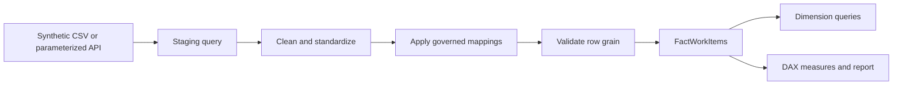

# Delivery Dashboard Data Preparation

[← Back to the case overview](README.md) · [Synthetic dataset](data/synthetic-work-items.csv) · [Metric dictionary](metric-dictionary.md) · [Semantic model](semantic-model.md)

## Purpose

This document describes the recommended Power Query preparation flow for the public Data Governance Delivery Dashboard.

It provides:

- a reproducible route for the published synthetic CSV;
- an adaptable parameterized route for a live work-management Analytics API;
- controlled status mapping;
- explicit data types and null handling;
- reusable fact and dimension queries;
- validation rules before data reaches the semantic model.

No private endpoint, organization, project, credential, or personal identifier is included.

## Preparation architecture



## Query-layer convention

| Prefix | Layer | Load setting |
| --- | --- | --- |
| `p_` | Parameters | Not applicable |
| `stg_` | Source-aligned staging | Disable load |
| `map_` | Controlled mapping tables | Load when used as dimensions |
| `Fact` | Fact tables | Enable load |
| `Dim` | Dimensions | Enable load |
| `qa_` | Validation and exception queries | Enable only when required for monitoring |

The staging layer preserves source traceability. Business-friendly names belong in the modeled fact and dimensions.

## 1. Public synthetic-data route

Create a Text parameter:

```text
p_SyntheticCsvUrl
```

Example value:

```text
https://raw.githubusercontent.com/jmfeitosa/data-governance-portfolio/main/cases/02-delivery-dashboard/data/synthetic-work-items.csv
```

### stg_WorkItemsCsv

```powerquery
let
    Source =
        Csv.Document(
            Web.Contents(p_SyntheticCsvUrl),
            [
                Delimiter = ",",
                Columns = 19,
                Encoding = 65001,
                QuoteStyle = QuoteStyle.Csv
            ]
        ),
    PromotedHeaders =
        Table.PromoteHeaders(
            Source,
            [PromoteAllScalars = true]
        ),
    TypedColumns =
        Table.TransformColumnTypes(
            PromotedHeaders,
            {
                {"WorkItemId", Int64.Type},
                {"Title", type text},
                {"WorkItemType", type text},
                {"State", type text},
                {"NormalizedStatus", type text},
                {"Workstream", type text},
                {"IterationPath", type text},
                {"AssignedTo", type text},
                {"Phase", type text},
                {"CreatedDate", type date},
                {"ActivatedDate", type date},
                {"ChangedDate", type date},
                {"ClosedDate", type date},
                {"DueDate", type date},
                {"Priority", Int64.Type},
                {"StoryPoints", type number},
                {"ParentWorkItemId", Int64.Type},
                {"IsBlocked", type logical},
                {"Tags", type text}
            },
            "en-US"
        )
in
    TypedColumns
```

For a controlled production solution, fixed column counts can be replaced with explicit schema validation so unexpected additions or missing columns generate visible exceptions.

## 2. Parameterized API route

A live implementation can use parameters such as:

| Parameter | Purpose |
| --- | --- |
| `p_ODataEndpoint` | Complete approved Analytics endpoint. |
| `p_ProjectScope` | Optional approved project or portfolio scope. |
| `p_ReportingTimezone` | Timezone used in date and refresh logic. |
| `p_StaleThresholdDays` | Approved threshold for inactivity monitoring. |
| `p_Environment` | Development, Test, or Production. |

Generic source pattern:

```powerquery
let
    Source =
        OData.Feed(
            p_ODataEndpoint,
            null,
            [Implementation = "2.0"]
        ),
    WorkItems =
        Source{
            [
                Name = "WorkItems",
                Signature = "table"
            ]
        }[Data],
    SelectedColumns =
        Table.SelectColumns(
            WorkItems,
            {
                "WorkItemId",
                "Title",
                "WorkItemType",
                "State",
                "CreatedDate",
                "ActivatedDate",
                "ChangedDate",
                "ClosedDate",
                "DueDate",
                "Priority",
                "StoryPoints",
                "ParentWorkItemId",
                "TagNames",
                "Iteration",
                "AssignedTo"
            },
            MissingField.UseNull
        )
in
    SelectedColumns
```

The endpoint value belongs in an environment parameter or deployment configuration. It must not be embedded in a public template.

## 3. Expand structured source fields

When the API returns records for iteration and assignee, expand only the required attributes.

```powerquery
let
    ExpandedIteration =
        Table.ExpandRecordColumn(
            stg_WorkItemsApi,
            "Iteration",
            {"IterationPath"},
            {"IterationPath"}
        ),
    ExpandedAssignee =
        Table.ExpandRecordColumn(
            ExpandedIteration,
            "AssignedTo",
            {"UserName"},
            {"AssignedTo"}
        )
in
    ExpandedAssignee
```

Use `MissingField.UseNull` or explicit exception logic when source schemas can vary across processes.

## 4. Clean and standardize text

Recommended controls:

- apply `Text.Clean` to remove non-printing characters;
- apply `Text.Trim` to remove leading and trailing whitespace;
- replace blank assignees with `Unassigned`;
- replace blank workstreams or phases with controlled exception members;
- preserve the original source state for traceability;
- standardize only through approved mappings.

Example:

```powerquery
let
    CleanedText =
        Table.TransformColumns(
            stg_WorkItemsCsv,
            {
                {
                    "Title",
                    each if _ = null then null else Text.Trim(Text.Clean(_)),
                    type text
                },
                {
                    "WorkItemType",
                    each if _ = null then null else Text.Trim(Text.Clean(_)),
                    type text
                },
                {
                    "State",
                    each if _ = null then null else Text.Trim(Text.Clean(_)),
                    type text
                },
                {
                    "Workstream",
                    each
                        if _ = null or Text.Trim(_) = ""
                        then "Unknown Workstream"
                        else Text.Trim(Text.Clean(_)),
                    type text
                },
                {
                    "AssignedTo",
                    each
                        if _ = null or Text.Trim(_) = ""
                        then "Unassigned"
                        else Text.Trim(Text.Clean(_)),
                    type text
                },
                {
                    "Phase",
                    each
                        if _ = null or Text.Trim(_) = ""
                        then "Unassigned"
                        else Text.Trim(Text.Clean(_)),
                    type text
                }
            }
        )
in
    CleanedText
```

## 5. Controlled status mapping

Status normalization should not be implemented differently in multiple source queries.

### map_Status

```powerquery
let
    StatusMapping =
        #table(
            type table[
                SourceState = text,
                NormalizedStatus = text,
                StatusGroup = text,
                SortOrder = Int64.Type
            ],
            {
                {"New", "New", "Open", 1},
                {"To Do", "New", "Open", 1},
                {"Active", "Active", "Open", 2},
                {"Doing", "Active", "Open", 2},
                {"Resolved", "In Validation", "Open", 3},
                {"In Validation", "In Validation", "Open", 3},
                {"On Hold", "On Hold", "Paused", 4},
                {"Closed", "Closed", "Completed", 5},
                {"Done", "Closed", "Completed", 5}
            }
        )
in
    StatusMapping
```

The treatment of `Removed` must be approved. Depending on the workflow, it may be excluded from delivery scope or mapped to a separately reported terminal status.

### Apply the mapping

```powerquery
let
    JoinedStatus =
        Table.NestedJoin(
            CleanedWorkItems,
            {"State"},
            map_Status,
            {"SourceState"},
            "StatusMapping",
            JoinKind.LeftOuter
        ),
    ExpandedStatus =
        Table.ExpandTableColumn(
            JoinedStatus,
            "StatusMapping",
            {
                "NormalizedStatus",
                "StatusGroup",
                "SortOrder"
            },
            {
                "NormalizedStatusMapped",
                "StatusGroup",
                "StatusSortOrder"
            }
        ),
    StatusWithException =
        Table.ReplaceValue(
            ExpandedStatus,
            null,
            "Other",
            Replacer.ReplaceValue,
            {"NormalizedStatusMapped"}
        ),
    AddedStatusException =
        Table.AddColumn(
            StatusWithException,
            "HasStatusMappingException",
            each [NormalizedStatusMapped] = "Other",
            type logical
        )
in
    AddedStatusException
```

The source-provided `NormalizedStatus` column in the synthetic CSV is useful for validation. The controlled mapping should remain the authoritative implementation.

## 6. Workstream derivation

When `Workstream` is not supplied explicitly, it can be derived from an approved iteration-path mapping.

Avoid embedding many exact path values in individual measures.

### Preferred design

Create a controlled table:

| IterationPathPattern | Workstream | WorkstreamGroup | IsActive |
| --- | --- | --- | --- |
| Portfolio\Governance Foundation | Governance Foundation | Enterprise | true |
| Portfolio\Metadata and Lineage | Metadata and Lineage | Data Management | true |
| Portfolio\Data Quality | Data Quality | Data Management | true |
| Portfolio\Access and Privacy | Access and Privacy | Risk and Compliance | true |
| Portfolio\Master Data and Lifecycle | Master Data and Lifecycle | Data Management | true |

Use an exact join when paths are controlled. Use text-pattern rules only when the source hierarchy cannot provide stable keys.

## 7. Phase derivation

The preferred source is an explicit roadmap phase field.

If phase must be inferred from tags, use a governed mapping rather than relying on tag position.

Example exception-aware function:

```powerquery
(tagText as nullable text) as text =>
let
    NormalizedTags =
        if tagText = null
        then ""
        else Text.Lower(Text.Trim(tagText)),
    Result =
        if Text.Contains(NormalizedTags, "phase-1") then "Phase 1"
        else if Text.Contains(NormalizedTags, "phase-2") then "Phase 2"
        else if Text.Contains(NormalizedTags, "phase-3") then "Phase 3"
        else "Unassigned"
in
    Result
```

If multiple phase tags are present, route the row to a validation exception instead of silently selecting the first match.

## 8. Tag handling

The synthetic CSV stores tags as semicolon-delimited text.

### Display-only use

Keep the original `Tags` field if tags are shown only in detail tables.

### Filterable tag use

Create one row per work-item/tag combination:

```powerquery
let
    Selected =
        Table.SelectColumns(
            FactWorkItems,
            {"WorkItemId", "Tags"}
        ),
    SplitToList =
        Table.TransformColumns(
            Selected,
            {
                {
                    "Tags",
                    each
                        if _ = null or Text.Trim(_) = ""
                        then {}
                        else List.Transform(
                            Text.Split(_, ";"),
                            each Text.Trim(_)
                        ),
                    type list
                }
            }
        ),
    ExpandedTags =
        Table.ExpandListColumn(
            SplitToList,
            "Tags"
        ),
    Renamed =
        Table.RenameColumns(
            ExpandedTags,
            {{"Tags", "TagName"}}
        ),
    RemovedBlankTags =
        Table.SelectRows(
            Renamed,
            each [TagName] <> null and [TagName] <> ""
        ),
    DistinctRows =
        Table.Distinct(RemovedBlankTags)
in
    DistinctRows
```

This result can become `BridgeWorkItemTag` and support a separate `DimTag`.

## 9. FactWorkItems

The final fact query should:

1. reference the cleaned staging query;
2. apply controlled status and workstream mappings;
3. preserve one row per current `WorkItemId`;
4. select only modeled columns;
5. expose data-quality exception flags;
6. avoid business calculations better implemented as measures.

Example final selection:

```powerquery
let
    Source = PreparedWorkItems,
    SelectedColumns =
        Table.SelectColumns(
            Source,
            {
                "WorkItemId",
                "Title",
                "WorkItemType",
                "State",
                "NormalizedStatusMapped",
                "StatusGroup",
                "Workstream",
                "IterationPath",
                "AssignedTo",
                "Phase",
                "CreatedDate",
                "ActivatedDate",
                "ChangedDate",
                "ClosedDate",
                "DueDate",
                "Priority",
                "StoryPoints",
                "ParentWorkItemId",
                "IsBlocked",
                "Tags",
                "HasStatusMappingException"
            }
        ),
    RenamedColumns =
        Table.RenameColumns(
            SelectedColumns,
            {
                {
                    "NormalizedStatusMapped",
                    "NormalizedStatus"
                }
            }
        )
in
    RenamedColumns
```

## 10. Dimension queries

Dimensions should reference `FactWorkItems` or controlled reference sources.

### DimWorkstream

```powerquery
let
    Source = FactWorkItems,
    Selected =
        Table.SelectColumns(
            Source,
            {"Workstream"}
        ),
    DistinctRows = Table.Distinct(Selected),
    SortedRows =
        Table.Sort(
            DistinctRows,
            {{"Workstream", Order.Ascending}}
        ),
    AddedKey =
        Table.AddIndexColumn(
            SortedRows,
            "WorkstreamKey",
            1,
            1,
            Int64.Type
        )
in
    AddedKey
```

For a production model, stable keys should come from a governed source or deterministic mapping rather than an index whose value could change when rows are added.

### DimAssignee

Map blank values to `Unassigned` before creating the dimension so operational views do not hide missing ownership.

### DimWorkItemType

Add controlled attributes:

| WorkItemType | HierarchyLevel | IsDeliveryItem | SortOrder |
| --- | --- | --- | ---: |
| Epic | Portfolio | false | 1 |
| Feature | Capability | false | 2 |
| User Story | Delivery | true | 3 |
| Enabler | Delivery | true | 4 |
| Task | Delivery | true | 5 |
| Bug | Delivery | true | 6 |

### DimDate

The date table can be created in Power Query from the full reporting range.

```powerquery
let
    MinimumDate =
        List.Min(
            List.RemoveNulls(
                FactWorkItems[CreatedDate]
            )
        ),
    MaximumDate =
        List.Max(
            List.RemoveNulls(
                List.Combine(
                    {
                        FactWorkItems[CreatedDate],
                        FactWorkItems[ActivatedDate],
                        FactWorkItems[ChangedDate],
                        FactWorkItems[ClosedDate],
                        FactWorkItems[DueDate]
                    }
                )
            )
        ),
    DateList =
        List.Dates(
            Date.StartOfYear(MinimumDate),
            Duration.Days(
                Date.EndOfYear(MaximumDate)
                    - Date.StartOfYear(MinimumDate)
            ) + 1,
            #duration(1, 0, 0, 0)
        ),
    ToTable =
        Table.FromList(
            DateList,
            Splitter.SplitByNothing(),
            {"Date"}
        ),
    TypedDate =
        Table.TransformColumnTypes(
            ToTable,
            {{"Date", type date}}
        ),
    AddedYear =
        Table.AddColumn(
            TypedDate,
            "Year",
            each Date.Year([Date]),
            Int64.Type
        ),
    AddedMonthNumber =
        Table.AddColumn(
            AddedYear,
            "MonthNumber",
            each Date.Month([Date]),
            Int64.Type
        ),
    AddedMonth =
        Table.AddColumn(
            AddedMonthNumber,
            "Month",
            each Date.ToText([Date], "MMM", "en-US"),
            type text
        ),
    AddedYearMonth =
        Table.AddColumn(
            AddedMonth,
            "YearMonth",
            each Date.ToText([Date], "yyyy-MM", "en-US"),
            type text
        ),
    AddedWeekStart =
        Table.AddColumn(
            AddedYearMonth,
            "WeekStart",
            each Date.StartOfWeek([Date], Day.Monday),
            type date
        )
in
    AddedWeekStart
```

Mark `DimDate` as the model's date table and disable automatic date/time tables.

## 11. Data-quality checks

Create validation queries that return only exceptions.

### qa_DuplicateWorkItemId

```powerquery
let
    Grouped =
        Table.Group(
            FactWorkItems,
            {"WorkItemId"},
            {{"RowCount", each Table.RowCount(_), Int64.Type}}
        ),
    Exceptions =
        Table.SelectRows(
            Grouped,
            each [RowCount] > 1
        )
in
    Exceptions
```

### qa_InvalidDateSequence

```powerquery
let
    Exceptions =
        Table.SelectRows(
            FactWorkItems,
            each
                (
                    [ActivatedDate] <> null
                    and [CreatedDate] <> null
                    and [ActivatedDate] < [CreatedDate]
                )
                or (
                    [ClosedDate] <> null
                    and [CreatedDate] <> null
                    and [ClosedDate] < [CreatedDate]
                )
        )
in
    Exceptions
```

### Recommended exception queries

- duplicate `WorkItemId`;
- missing required fields;
- unmapped source states;
- unknown workstreams;
- invalid date sequences;
- closed items without a close date;
- open items with a close date;
- child items without a valid parent where hierarchy is required;
- negative story points;
- invalid priority values;
- multiple phase tags.

Each exception query should have an owner and an expected response. Empty exception results should be treated as a test pass.

## 12. Privacy and security controls

- Use synthetic data for the public portfolio.
- Keep credentials in the Power BI Service or approved secret and identity mechanisms.
- Do not encode usernames, tokens, tenant IDs, or private endpoints in M scripts.
- Parameterize environment-specific values.
- Apply organizational privacy levels to combined sources.
- Review query diagnostics before sharing templates.
- Inspect data-source settings, parameters, cached previews, report metadata, and branding before publication.
- Treat a PBIT as potentially sensitive until its queries, parameters, model metadata, resources, and report definitions have been inspected.
- Validate export and sharing settings separately in the Power BI Service.

## 13. Refresh controls

A production operating procedure should record:

| Control | Required evidence |
| --- | --- |
| Source owner | Accountable role for source availability and schema. |
| Refresh owner | Role responsible for monitoring and recovery. |
| Schedule | Approved service refresh cadence. |
| Credentials | Valid service identity and expiry handling. |
| Gateway | Required gateway, cluster, and availability status where applicable. |
| Expected volume | Baseline row count and acceptable variation. |
| Duration | Typical refresh duration and alert threshold. |
| Failure response | Notification, escalation, retry, and incident path. |
| Last successful refresh | Visible timestamp in the report. |
| Schema change | Detection and controlled release procedure. |

Template inspection cannot confirm these service-layer controls.

## 14. Preparation validation checklist

- [ ] Public source contains only synthetic data.
- [ ] Source parameters contain no private endpoint.
- [ ] Required columns are selected explicitly.
- [ ] Data types are assigned explicitly.
- [ ] Text fields are cleaned and trimmed.
- [ ] Blank assignees map to Unassigned.
- [ ] Workstreams use a controlled mapping.
- [ ] Status normalization occurs once.
- [ ] Unmapped statuses remain visible as Other.
- [ ] Phase logic does not depend on tag position.
- [ ] FactWorkItems has one row per WorkItemId.
- [ ] Dimension members are unique.
- [ ] Invalid date sequences return zero rows.
- [ ] Closed and open-date logic is consistent.
- [ ] Query folding is preserved where supported and useful.
- [ ] Staging queries have load disabled.
- [ ] Refresh credentials and schedules are validated outside the template.
- [ ] No personal or internal identifiers remain in public artifacts.

## Disclaimer

This data-preparation design is an anonymized portfolio artifact. The example Power Query code is intended for the published synthetic model and should be tested and adapted for different source schemas, workflows, privacy requirements, data volumes, and Power BI environments.
