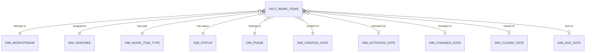

# Delivery Dashboard Semantic Model

[← Back to the case overview](README.md) · [Synthetic dataset](data/synthetic-work-items.csv) · [Metric dictionary](metric-dictionary.md)

## Purpose

This document defines the recommended semantic model for the public Data Governance Delivery Dashboard.

The design replaces duplicated work-item queries and implicit date tables with a controlled star schema that supports consistent DAX, clearer filtering, easier testing, and better maintainability.

## Design objectives

- Maintain one authoritative work-item fact table.
- Define an explicit and documented row grain.
- Use conformed dimensions for status, workstream, assignee, type, phase, and date.
- Centralize status normalization.
- Avoid bidirectional relationships unless a tested use case requires them.
- Keep business metrics in a dedicated measures table.
- Support executive, operational, backlog, and risk views.
- Make synthetic and live-source implementations structurally compatible.

## Model overview



The date-role dimensions in the diagram represent one physical `DimDate` table connected through role-playing relationships. Only one date relationship should be active at a time for the default analysis.

## Fact table

### FactWorkItems

**Grain:** one row per current work item identified by `WorkItemId`.

The public synthetic dataset represents the latest known state of each item. If revision history is introduced later, it should use a separate snapshot or event fact table rather than changing this grain.

| Column | Type | Purpose |
| --- | --- | --- |
| WorkItemId | Whole number | Stable unique identifier for the work item. |
| Title | Text | Short work-item description. |
| WorkItemType | Text / key | Epic, Feature, User Story, Task, Bug, or Enabler. |
| State | Text | Source-system workflow state. |
| NormalizedStatus | Text / key | Governed reporting state. |
| Workstream | Text / key | Delivery domain or workstream. |
| IterationPath | Text | Source iteration or hierarchy path. |
| AssignedTo | Text / key | Current responsible role or assignee. |
| Phase | Text / key | Roadmap phase. |
| CreatedDate | Date | Date the item was created. |
| ActivatedDate | Date | Date execution began. |
| ChangedDate | Date | Most recent recorded change. |
| ClosedDate | Date | Date the item was closed. |
| DueDate | Date | Planned completion date. |
| Priority | Whole number | Source or governed priority. |
| StoryPoints | Decimal or whole number | Relative effort estimate where applicable. |
| ParentWorkItemId | Whole number | Parent hierarchy reference. |
| IsBlocked | True/False | Explicit blocking indicator. |
| Tags | Text | Delimited source tags; use a bridge table if tag-level slicing is required. |

## Dimension tables

### DimDate

A single marked date table supports consistent period analysis.

| Column | Purpose |
| --- | --- |
| Date | Unique calendar date and relationship key. |
| Year | Calendar year. |
| Quarter | Calendar quarter. |
| MonthNumber | Numeric month used for sorting. |
| Month | Display month. |
| YearMonth | Stable period label, sorted chronologically. |
| WeekStart | Approved start date of the reporting week. |
| WeekNumber | Week number according to the selected business standard. |
| DayOfWeek | Display day name. |
| IsWorkingDay | Indicates working versus non-working days. |

Recommended date range:

```text
Minimum relevant work-item date
through
Maximum of actual dates, due dates, and the current reporting horizon
```

Do not rely on automatic date/time tables. Disable Auto date/time for the file after the explicit calendar is implemented.

### DimStatus

Centralizes workflow normalization and display behavior.

| Column | Purpose |
| --- | --- |
| SourceState | Source-system state. |
| NormalizedStatus | New, Active, In Validation, On Hold, Closed, or Other. |
| StatusGroup | Open, Completed, Paused, or Exception. |
| SortOrder | Controls visual order. |
| IsOpen | True/False indicator. |
| IsCompleted | True/False indicator. |
| RequiresReview | Flags unmapped or exceptional states. |

Example mapping:

| Source state | Normalized status | Status group | Sort order |
| --- | --- | --- | ---: |
| New | New | Open | 1 |
| To Do | New | Open | 1 |
| Active | Active | Open | 2 |
| Doing | Active | Open | 2 |
| Resolved | In Validation | Open | 3 |
| In Validation | In Validation | Open | 3 |
| On Hold | On Hold | Paused | 4 |
| Closed | Closed | Completed | 5 |
| Done | Closed | Completed | 5 |
| Removed | Governed decision required | Exception | 6 |
| Unmapped value | Other | Exception | 6 |

The mapping should be maintained once and reused across Power Query, the model, measures, documentation, and tests.

### DimWorkstream

| Column | Purpose |
| --- | --- |
| WorkstreamKey | Stable surrogate or controlled key. |
| WorkstreamName | Display name. |
| WorkstreamGroup | Optional grouping for executive reporting. |
| DataOwner | Optional accountable business role. |
| SortOrder | Approved visual order. |
| IsActive | Controls retired workstreams without deleting history. |

### DimAssignee

| Column | Purpose |
| --- | --- |
| AssigneeKey | Stable assignee identifier. |
| AssigneeDisplayName | Public version uses fictional role-based names. |
| Team | Optional operating team. |
| RoleCategory | Analyst, Steward, Architect, Engineer, Privacy, or another controlled role. |
| IsActive | Indicates whether the assignee remains active. |
| IsUnassigned | Identifies the governed unknown or unassigned member. |

Blank values should map to an explicit **Unassigned** member rather than disappearing from visuals.

### DimWorkItemType

| Column | Purpose |
| --- | --- |
| WorkItemTypeKey | Stable key. |
| WorkItemTypeName | Epic, Feature, User Story, Task, Bug, or Enabler. |
| HierarchyLevel | Portfolio, capability, or delivery item. |
| IsDeliveryItem | Identifies types included in execution metrics. |
| SortOrder | Controls visual order. |

The `IsDeliveryItem` flag prevents each DAX measure from hard-coding the same list of work-item types.

### DimPhase

| Column | Purpose |
| --- | --- |
| PhaseKey | Stable key. |
| PhaseName | Phase 1, Phase 2, Phase 3, or Unassigned. |
| PhaseOrder | Numeric sort order. |
| PlannedStartDate | Optional planned start. |
| PlannedEndDate | Optional planned end. |
| IsCurrent | Optional current-phase indicator. |

Phase should preferably originate from a controlled source field. If derived from tags, the transformation and exceptions must be documented and tested.

## Optional model extensions

### BridgeWorkItemTag

Use a bridge when each work item can have multiple independently filterable tags.

| Column | Purpose |
| --- | --- |
| WorkItemId | Fact-table reference. |
| TagKey | Dimension reference. |

A single delimited text field is sufficient for display but not for reliable many-tag filtering.

### DimTag

Stores one row per controlled tag, including tag group and description.

### FactWorkItemSnapshot

Use a separate periodic snapshot fact to analyze historical backlog and status movement.

Example grain:

```text
One row per WorkItemId per SnapshotDate
```

Possible measures include backlog size over time, status ageing, throughput, flow efficiency, and work-in-progress trends.

### FactWorkItemRevision

Use an event-level fact when every state or field revision is required.

Example grain:

```text
One row per WorkItemId per RevisionNumber
```

Do not append revisions to the current-state fact without changing its documented grain.

## Relationships

| From | To | Cardinality | Direction | Active |
| --- | --- | --- | --- | --- |
| FactWorkItems[WorkstreamKey] | DimWorkstream[WorkstreamKey] | Many-to-one | Single | Yes |
| FactWorkItems[AssigneeKey] | DimAssignee[AssigneeKey] | Many-to-one | Single | Yes |
| FactWorkItems[WorkItemTypeKey] | DimWorkItemType[WorkItemTypeKey] | Many-to-one | Single | Yes |
| FactWorkItems[StatusKey] | DimStatus[StatusKey] | Many-to-one | Single | Yes |
| FactWorkItems[PhaseKey] | DimPhase[PhaseKey] | Many-to-one | Single | Yes |
| FactWorkItems[CreatedDate] | DimDate[Date] | Many-to-one | Single | Yes |
| FactWorkItems[ActivatedDate] | DimDate[Date] | Many-to-one | Single | No |
| FactWorkItems[ChangedDate] | DimDate[Date] | Many-to-one | Single | No |
| FactWorkItems[ClosedDate] | DimDate[Date] | Many-to-one | Single | No |
| FactWorkItems[DueDate] | DimDate[Date] | Many-to-one | Single | No |

Inactive date relationships can be activated in measures with `USERELATIONSHIP`.

Example:

```DAX
Items Closed =
CALCULATE (
    [Completed Items],
    USERELATIONSHIP (
        'FactWorkItems'[ClosedDate],
        'DimDate'[Date]
    )
)
```

## Filter-direction rules

- Dimensions filter the fact table.
- Relationships use single-direction filtering by default.
- Measures should not depend on ambiguous bidirectional propagation.
- Many-to-many relationships require an explicit bridge and tested use case.
- Visual interactions must be reviewed independently of model relationships.
- Page filters must not hide workstreams, types, or assignees without a visible explanation.

## Work-item hierarchy

The public dataset includes `ParentWorkItemId`, supporting:

```text
Epic → Feature → User Story / Enabler → Task / Bug
```

Hierarchy analysis can be implemented through:

1. a parent-child helper table;
2. Power Query expansion of the required parent levels;
3. a path-based model when stable recursive hierarchy behavior is needed.

A work-item hierarchy must not be interpreted as a one-to-many relational dimension unless the transformation guarantees the required grain.

## Calculated columns versus measures

### Prefer Power Query or dimension attributes for

- normalized status;
- controlled workstream;
- phase mapping;
- unassigned-member handling;
- tag splitting;
- stable business categories;
- reusable keys.

### Prefer DAX measures for

- filtered counts;
- completion rates;
- open workload;
- blocked, overdue, stale, and at-risk metrics;
- ageing and cycle time;
- time-intelligence calculations;
- ranking;
- reconciliation checks.

Avoid calculated columns that use `TODAY()` for risk or ageing because they may become stale between dataset refreshes and increase model size.

## Measures table

Create a dedicated table named:

```text
_Measures
```

Recommended display folders:

```text
01 Portfolio
02 Delivery Status
03 Risk and Ageing
04 Ownership and Workload
05 Effort
06 Data Quality
07 Time Intelligence
99 Technical
```

Measure definitions are documented in the [Metric Dictionary](metric-dictionary.md).

## Naming conventions

| Object | Convention | Example |
| --- | --- | --- |
| Fact table | Fact + plural subject | FactWorkItems |
| Dimension | Dim + singular subject | DimStatus |
| Bridge | Bridge + relationship subject | BridgeWorkItemTag |
| Snapshot fact | Fact + subject + Snapshot | FactWorkItemSnapshot |
| Measure table | Leading underscore | _Measures |
| Key | Subject + Key | WorkstreamKey |
| Boolean attribute | Is / Has prefix | IsBlocked |
| Measure | Business-readable name | Completion Rate |

Technical source names can be preserved in the staging layer, but user-facing model objects should use stable business terminology.

## Data-quality constraints

| Rule | Expected result |
| --- | --- |
| WorkItemId is unique in FactWorkItems. | No duplicate current-state identifiers. |
| WorkItemId is not blank. | 100% populated. |
| Every fact key resolves to a dimension member. | No unintended orphan keys. |
| Every source state resolves to DimStatus. | Unmapped values route to Other and require review. |
| Closed items have a ClosedDate where the source provides it. | Exceptions are visible. |
| ClosedDate is not earlier than CreatedDate. | Zero invalid rows. |
| ActivatedDate is not earlier than CreatedDate. | Zero invalid rows. |
| DueDate uses the approved date type and timezone logic. | Consistent reporting date. |
| IsDeliveryItem matches the metric dictionary. | Executive and operational totals reconcile. |
| Blank assignees map to Unassigned. | No silent omission from workload views. |

## Source and refresh design

### Public portfolio version

```text
Synthetic CSV → Power Query → Star schema → DAX → Report
```

### Adaptable live version

```text
Work-management Analytics API
→ Parameterized Power Query
→ Controlled staging
→ Star schema
→ DAX
→ Power BI Service
```

Recommended parameters:

- source organization;
- source project;
- API version;
- optional area or iteration scope;
- reporting timezone;
- stale-item threshold;
- refresh-range controls where incremental refresh is used.

Public files must not include private endpoints, tokens, credentials, tenant identifiers, internal project names, or personal data.

## Security considerations

- The public synthetic model requires no row-level security.
- A production model should assess whether workstream, domain, region, or management-level restrictions are required.
- Report access does not replace source-system authorization.
- Export settings must align with data classification.
- Workspace roles, application audiences, sharing links, and service principals must be reviewed separately from the PBIX or PBIT file.
- Credentials and refresh configuration are service-layer controls and cannot be validated from the template alone.

## Performance considerations

- Select only required source columns.
- Consolidate duplicate work-item queries.
- Use integer keys where practical.
- Prefer dimensions over repeated high-cardinality text in visuals.
- Disable unnecessary automatic date tables.
- Avoid bidirectional relationships without evidence.
- Keep iterators scoped to the smallest valid population.
- Use a snapshot model only when historical analysis is required.
- Test refresh duration, model size, and visual query performance with representative volume.

## Migration from the assessed structure

| Assessed structure | Recommended public design |
| --- | --- |
| Two imported work-item tables | One FactWorkItems current-state fact |
| Different status-normalization logic | One controlled DimStatus mapping |
| Bidirectional 1:1 work-item relationship | Removed through fact consolidation |
| Multiple automatic date tables | One explicit DimDate with role-playing relationships |
| Fixed assignee filters | DimAssignee with dynamic ranking |
| Measures distributed across source tables | Central _Measures table with display folders |
| Direct iteration strings in measures | Controlled DimWorkstream |
| Split tag columns based on position | Optional tag bridge when filtering is required |

## Model validation checklist

- [ ] Fact grain is documented and unique.
- [ ] Duplicate WorkItemId values are resolved.
- [ ] Dimension keys are unique.
- [ ] Orphan fact keys map to controlled Unknown or Unassigned members.
- [ ] Relationships use the expected cardinality and single direction.
- [ ] CreatedDate is the intentional active date relationship.
- [ ] Date-specific measures activate the correct relationship.
- [ ] Status mappings cover every source state.
- [ ] IsDeliveryItem matches the metric dictionary.
- [ ] Executive and operational totals reconcile.
- [ ] Risk-detail rows reconcile to risk cards.
- [ ] Blank assignees remain visible.
- [ ] Default filters are neutral or disclosed.
- [ ] Auto date/time is disabled.
- [ ] Model objects use business-readable names.
- [ ] Public artifacts contain no internal identifiers.

## Disclaimer

This semantic-model design is an anonymized portfolio artifact. It describes a recommended public architecture based on technical assessment and must be adapted and tested for each source system, workflow, data volume, security model, and reporting requirement.
