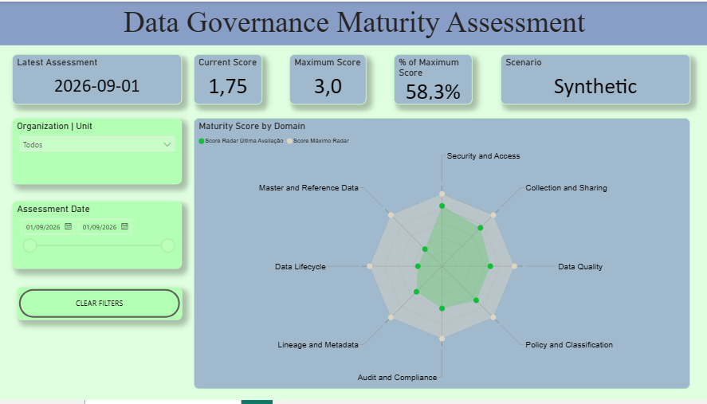

# Data Governance Maturity Assessment

[Back to portfolio](../../README.md)

**Published:** model, questionnaire, scoring methodology, roadmap, synthetic CSV, data dictionary, and reviewed Power BI template. A screenshot of the running template is published below.

A portfolio case demonstrating how a structured maturity assessment can translate governance controls into measurable gaps, priorities, and an actionable improvement roadmap.

> **Portfolio notice:** all public examples and assessment results in this repository use synthetic data. Names, email addresses, organizations, responses, evidence, scores, infrastructure details, and other internal information from the original work are excluded.

## Business Challenge

Organizations often know that governance practices need improvement but lack a consistent way to answer three questions:

1. What capabilities already exist?
2. Where are the most relevant control gaps?
3. Which initiatives should be prioritized first?

This case addresses that challenge through a repeatable assessment model supported by evidence, scoring rules, visual analysis, and a phased roadmap.

## Assessment Scope

The operational assessment covers eight governance domains:

| # | Domain | Assessment focus |
|---|---|---|
| 1 | Governance Policy and Data Classification | Accountabilities, policies, classification, and periodic review |
| 2 | Data Lineage and Metadata Repository | Cataloguing, ownership, lineage, and schema-change controls |
| 3 | Data Quality | Quality rules, service levels, alerts, and remediation |
| 4 | Master and Reference Data | Critical entities, authoritative sources, identifiers, and golden-record rules |
| 5 | Data Security and Access | Classification-based controls, role-based access, tagging, and non-production data |
| 6 | Data Lifecycle | Retention, archiving, disposal, cascade deletion, and audit evidence |
| 7 | Data Collection and Sharing | Purpose, legal basis, authorization, external sharing, and consent withdrawal |
| 8 | Data Audit and Compliance | Control testing, access reviews, inactive accounts, and security indicators |

Each domain contains four control questions, producing a 32-question assessment.

## Scoring Model

Controls are scored on a four-point scale:

| Score | Level | General interpretation |
|---:|---|---|
| 0 | Nonexistent | No formal initiative or repeatable control is established |
| 1 | Reactive | Activities occur mainly in response to issues and are not standardized |
| 2 | Defined and Managed | Processes are documented, standardized, assigned, and managed |
| 3 | Optimized | Processes are measured, reviewed, and continuously improved |

For the complete synthetic baseline, the domain score is the arithmetic mean of its four validated control scores, and the overall score is the mean of the eight domain scores. Do not substitute zero for missing or unverified responses. Partial assessments require the eligibility and coverage rules in the [scoring methodology](scoring-methodology.md).

```text
Domain Score = Sum of control scores in the domain / 4
Overall Score = Sum of the eight domain scores / 8
```

A numeric score does not replace professional judgment. Evidence quality, control criticality, regulatory exposure, and business context must also be considered when prioritizing action.

## Assessment Workflow

1. Define the organizational scope and assessment participants.
2. Collect structured responses and supporting evidence.
3. Validate responses with control owners and stakeholders.
4. Calculate control, domain, and overall maturity scores.
5. Identify gaps, dependencies, risks, and quick wins.
6. Prioritize initiatives by business value, risk, and implementation effort.
7. Publish a phased improvement roadmap.
8. Reassess periodically to measure progress.

## Published artifacts

- [Maturity model](maturity-model.md)
- [Assessment questionnaire](assessment-questionnaire.md)
- [Scoring methodology](scoring-methodology.md)
- [Improvement roadmap](improvement-roadmap.md)
- [Synthetic assessment results](data/synthetic-assessment-results.csv)
- [Data dictionary and CSV import guidance](data-dictionary.md)
- [Power BI template](powerbi/DataGovernance_Maturity_Assessment.pbit)
- [Power BI usage guide](powerbi/README.md)

## Dashboard screenshot



Actual screenshot supplied by the author from the reviewed synthetic template. Date: 2026-09-01; score: 1.75/3; percentage of maximum: 58.3%. Automatic legend and slicer text still includes Portuguese labels; an English-only visual polish pass remains.

## Explore the demonstration

The fictional baseline contains 32 validated controls across eight domains. Its overall score is **1.75 / 3**. The Power BI template reproduces the domain aggregates using an inline synthetic table; it does **not** automatically import the 33-column CSV.

Use the CSV and methodology to inspect question-level evidence descriptions, targets, and roadmap links. Synthetic evidence references are illustrative labels, not links to real evidence files. The Power BI report shows **58.3% of the maximum score**, not compliance or assessment coverage.

## Privacy and Publication Controls

The public version will not include:

- Participant names or email addresses
- Real organization or business-area names
- Original answers, comments, or uploaded evidence
- Actual maturity scores
- Internal system, infrastructure, supplier, or project references
- Unsanitized spreadsheet, web application, or Power BI files

Synthetic records will preserve the analytical structure without reproducing confidential assessment results.

## Tools and Practices

- Data governance maturity assessment
- Evidence-based control evaluation
- Microsoft Excel
- Power BI
- Data visualization
- Gap analysis and roadmap prioritization
- Privacy-aware portfolio publishing

## Current Status

Core documentation and the sanitized template are published. The author confirmed successful Desktop use and supplied the reviewed export; a follow-up static review found no original personal/corporate references in the checked content. Power BI Service deployment is outside this demonstration.

Screenshot published. Remaining: English legend/slicer polish. The template description still contains an earlier validation-pending note; this is a metadata wording issue retained to preserve the tested file.